# 米家插件通用UI组件手册

## 前言

为了统一米家插件的UI风格，提高插件接入效率，米家插件SDK计划提供给插件开发者一套常用的UI组件，目前正在持续开发输出中。

**已完成**

- [导航栏(TitleBar)](#导航栏TitleBar)
- [普通列表项(ListItem)](#普通列表项ListItem)
- [带开关的列表项(ListItemWithSwitch)](#带开关的列表项ListItemWithSwitch)
- [带滑动条的列表项(ListItemWithSlider)](#带滑动条的列表项ListItemWithSlider)
- [横向分割线(Separator)](#横向分割线Separator)
- [米家插件通用设置(CommonSetting)](#米家插件通用设置CommonSetting)
- [卡片容器(Card)](#卡片容器Card)
- [点按选档](#normalgear)
- [拖拽选档](#draggear)
- [单选框](#radio)
- [复选框](#checkbox)
- [开关](#switch)

**开发中**

- 新版导航栏

- 常用卡片

**计划中**

- 米家弹窗

## 导航栏(TitleBar)

### 预览

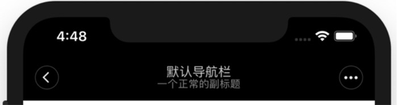

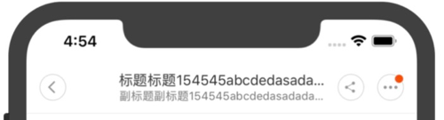

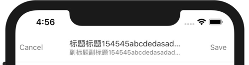

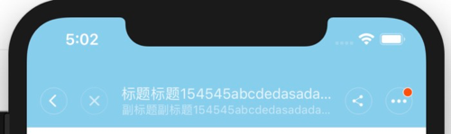

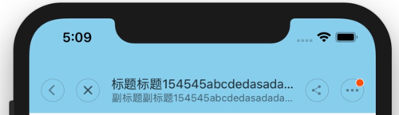

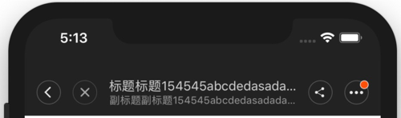

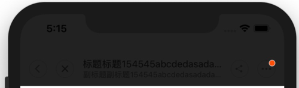

 ### 基本信息

| 基本信息  |                                        |
| --------- | -------------------------------------- |
| 中文名称  | 导航栏                                 |
| 描述      | 米家通用导航栏，目前正在开发新版导航栏 |
| 位置      | `miot/ui/TitleBar`                     |
| SDK_Level | `SDK_10000`                            |
| 注意事项  | \                                      |

*⚠️SDK_Level指的是从`SDK_XXXXX`开始可以使用该组件*

### 使用方法

```jsx
<TitleBar
  type='light'
  title='title'
  subTitle='subtitle'
  style={{ height: 65, backgroundColor: '#222' }}
  onPressLeft={() => { navigation.goBack() }}
  onPressLeft2={() => console.log('onPressLeft2')}        
  onPressRight={() => { navigation.navigate('moreMenu', { 'title': '设置' }) }}
  onPressRight2={() => console.log('onPressRight2')}
  showDot={this.state.showDot}
/>
```

### 参数

| Name | Type | Description |
| --- | --- | --- |
| type | `string` | 导航栏类型 options: ["dark", "light"(default)], `dark`默认表示白底黑字， `light`默认表示黑底白字 |
| style | `style` | 导航栏整体的样式， 会覆盖 `type`的默认设置 |
| leftTextStyle | `style` | 左侧文字样式，和 `leftText` 一起使用，不设置使用米家默认值 |
| leftText | `string` | 左侧文字 |
| onPressLeft | `func` | 左侧点击事件，设置了才显示左侧文字或图片，如果设置了`leftText`则显示设置的文字，否则显示默认的返回按钮。 |
| onPressLeft2 | `func` | 左侧的第二个点击事件，设置了才显示默认的关闭按钮， |
| rightTextStyle | `style` | 右侧文字样式，和 `rightText` 一起使用，不设置使用米家默认值 |
| rightText | `string` | 右侧文字 |
| onPressRight | `func` | 右侧点击事件，设置了才显示右侧文字或图片，如果设置了 `rightText` 则显示设置的文字，否则显示默认的更多按钮。 |
| onPressRight2 | `func` | 右侧的第二个点击事件，设置了才显示默认的分享按钮 |
| title | `string` | 中间的标题 |
| subTitle | `string` | 中间的子标题 |
| onPressTitle | `func` | 点击标题的事件 |
| showDot | `bool` | 是否显示右侧更多按钮的小红点 |

## 普通列表项(ListItem)

### 预览

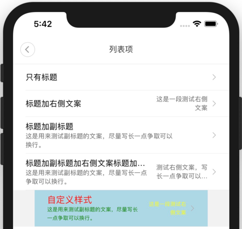

### 基本信息

| 基本信息  |                                                      |
| --------- | ---------------------------------------------------- |
| 中文名称  | 普通列表项                                           |
| 描述      | 常用的列表项，带有右箭头，可设置标题/副标题/右侧文字 |
| 位置      | `miot/ui/ListItem/ListItem`                          |
| SDK_Level | `SDK_10004`                                          |
| 注意事项  | \                                                    |

### 使用方法

```jsx
<ListItem
  title='自定义样式'
  subtitle='这是用来测试副标题的文案，尽量写长一点争取可以换行。'
  value='这是一段测试右侧文案'
  containerStyle={{ width: width * 0.8, backgroundColor: 'lightblue' }}
  titleStyle={{ fontSize: 17, color: 'red' }}
  subtitleStyle={{ fontSize: 10, color: 'green' }}
  valueStyle={{ fontSize: 10, color: 'yellow' }}
  onPress={_ => console.log(4)}
  separator={<Separator />}
/>
```

### 参数

| Name | Type | Description |
| --- | --- | --- |
| title | <code>string</code> | 左侧主标题 |
| subtitle | <code>string</code> | 右侧副标题 |
| value | <code>string</code> | 右侧文案 |
| onPress | <code>function</code> | 点击事件 |
| disabled | <code>bool</code> | 是否禁用点击，默认值 `false` |
| showSeparator | <code>bool</code> | 是否显示分割线，默认值 `true` |
| separator | <code>component</code> | 自定义分割线，不传将显示默认样式的分割线 |
| containerStyle | <code>style</code> | 列表项的自定义样式 |
| titleStyle | <code>style</code> | 标题的自定义样式 |
| subtitleStyle | <code>style</code> | 副标题的自定义样式 |
| valueStyle | <code>style</code> | 右侧文案的自定义样式 |

## 带开关的列表项(ListItemWithSwitch)

### 预览

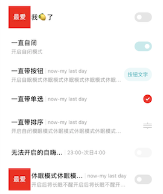

### 基本信息

| 基本信息  |                                                            |
| --------- | ---------------------------------------------------------- |
| 中文名称  | 带开关的列表项                                             |
| 描述      | 常用的列表项，右侧带有开关，可设置标题/标题右侧文字/副标题 |
| 位置      | `miot/ui/ListItem/ListItemWithSwitch`                      |
| SDK_Level | `SDK_10004`                                                |
| 注意事项  | \                                                          |

### 使用方法

```jsx
<ListItemWithSwitch
  title='标题测试标题测试标题测试标题测试标题测试标题测试'
  valueText='测试测试测试测试测试测试测试测试测试测试测试'
  subtitle='副标题测试副标题测试副标题测试副标题测试副标题测试副标题测试'
  onPress={_ => console.log('do what u want to do')}
  onValueChange={value => console.log(value)}
  containerStyle={{ width: width * 0.8, backgroundColor: 'lightblue' }}
  titleStyle={{ fontSize: 17, color: 'red' }}
  subtitleStyle={{ fontSize: 10, color: 'green' }}
  valueTextStyle={{ fontSize: 10, color: 'yellow' }}
  separator={<Separator />}
/>
```

### 参数

| Name | Type | Description |
| --- | --- | --- |
| title | <code>string</code> | 左侧主标题 |
| subtitle | <code>string</code> | 左侧副标题，主标题下方 |
| valueText | <code>string</code> | 主标题右侧文案 |
| value | <code>bool</code> | 开关状态，默认值 `false` |
| disabled | <code>bool</code> | 是否禁用开关，默认值 `false` |
| onPress | <code>function</code> | 列表项点击事件，不传则不具有点击态（disabled） |
| onValueChange | <code>function</code> | 开关切换事件 |
| showSeparator | <code>bool</code> | 是否显示分割线，默认值 `true` |
| separator | <code>component</code> | 自定义分割线，不传将显示默认样式的分割线 |
| containerStyle | <code>style</code> | 列表项的自定义样式 |
| titleStyle | <code>style</code> | 主标题的自定义样式 |
| subtitleStyle | <code>style</code> | 副标题的自定义样式 |
| valueTextStyle | <code>style</code> | 主标题右侧文案的自定义样式 |

## 带滑动条的列表项(ListItemWithSlider)

### 预览

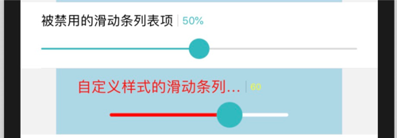

### 基本信息

| 基本信息  |                                                       |
| --------- | ----------------------------------------------------- |
| 中文名称  | 带滑动条的列表项                                      |
| 描述      | 常用的列表项，标题下方有滑动条，可设置标题/滑动条样式 |
| 位置      | `miot/ui/ListItem/ListItemWithSlider`                 |
| SDK_Level | `SDK_10004`                                           |
| 注意事项  | \                                                     |

### 使用方法

```jsx
<ListItemWithSlider
  title='自定义样式的滑动条列表项自定义样式的滑动条列表项'
  sliderProps={{ minimumValue: 25, maximumValue: 75, value: 60 }}
  sliderStyle={{
    minimumTrackTintColor: "red",
    maximumTrackTintColor: "#fff",
    style: { width: width * 0.5, alignSelf: 'center' },
    trackStyle: { height: 4, borderRadius: 2 },
    thumbStyle: { width: 30, height: 30, borderRadius: 15 },
  }}
  containerStyle={{ width: width * 0.8, backgroundColor: 'lightblue' }}
  titleStyle={{ fontSize: 17, color: 'red' }}
  valueStyle={{ fontSize: 10, color: 'yellow' }}
  showWithPercent={false}
  onSlidingComplete={value => console.log(value)}
  separator={<Separator />}
/>
```

### 参数

| Name | Type | Description |
| --- | --- | --- |
| title | <code>string</code> | 标题 |
| sliderProps | <code>object</code> | `slider` 的属性值<br />默认值<br />{<br />  minimumValue:0,<br />  maximumValue:100,<br />  step:1,<br />  value:50<br />}<br />`minimumValue`: 最小值<br />`maximumValue`: 最大值<br />`step`: 步长<br />`value`: 当前值 |
| showWithPercent | <code>bool</code> | 是否以百分比显示当前值，默认值 `true` |
| sliderStyle | <code>object</code> | `slider` 的自定义样式<br />默认值<br />{<br />minimumTrackTintColor: "#32BAC0",<br />maximumTrackTintColor: "rgba(0,0,0,0.15)",<br />thumbTintColor: "#32BAC0",<br />style: {},<br />trackStyle: { height: 2, borderRadius: 1 },<br />thumbStyle: { width: 24, height: 24, borderRadius: 12 }<br />}<br />`minimumTrackTintColor`: slider 左侧已填充颜色<br />`maximumTrackTintColor`: slider 右侧未填充颜色<br />`thumbTintColor`: 可移动圆圈的填充颜色<br />`style`: slider 容器的自定义样式<br />`trackStyle`: 轨的自定义样式<br />`thumbStyle`: 可移动圆圈的自定义样式 |
| onSlidingComplete | <code>function</code> | 滑动结束回调函数 |
| disabled | <code>bool</code> | 是否禁用滑动，默认值 `false` |
| containerStyle | <code>style</code> | 列表项的自定义样式 |
| titleStyle | <code>style</code> | 标题的自定义样式 |
| valueStyle | <code>style</code> | `value`的自定义样式 |
| showSeparator | <code>bool</code> | 是否显示分割线，默认值 `true` |
| separator | <code>component</code> | 自定义分割线，不传将显示默认样式的分割线 |

## 横向分割线(Separator)

### 预览

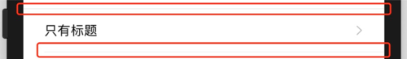

### 基本信息

| 基本信息  |                                                              |
| --------- | ------------------------------------------------------------ |
| 中文名称  | 横向分割线                                                   |
| 描述      | 横向分割线，常用于导航栏和列表项                             |
| 位置      | `miot/ui/Separator`                                          |
| SDK_Level | `SDK_10004`                                                  |
| 说明      | `<View style={{ height: 0.5, width: 300 }} />`的细分割线在`android`和`iOS`平台上显示不一致，于是才有了它。 |
| 注意事项  | `height`有最大限制(**maxHeight = 1**)                        |

### 使用方法

```jsx
<Separator /> // 通栏
<Separator style={{ marginLeft: 24，height: 2 }} /> // 左边距24，height设置2无效
```

### 参数

| Name | Type | Description |
| --- | --- | --- |
| style | <code>style</code> | 自定义样式 |

## 米家插件通用设置(CommonSetting)

### 预览

#### 一级页面所有设置项

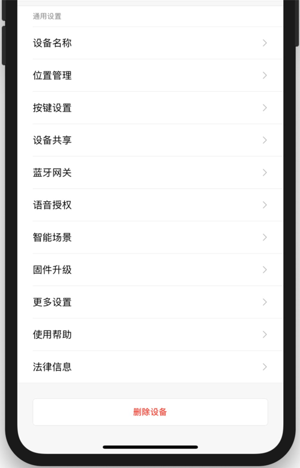

#### 一级页面必选设置项

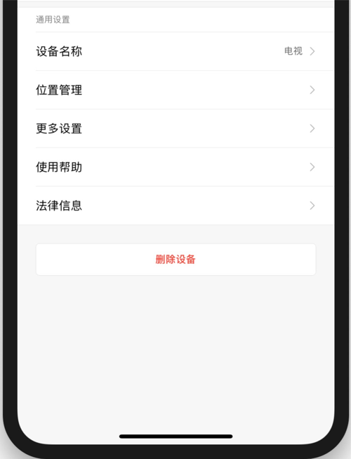

#### 「更多设置」二级页面所有设置项

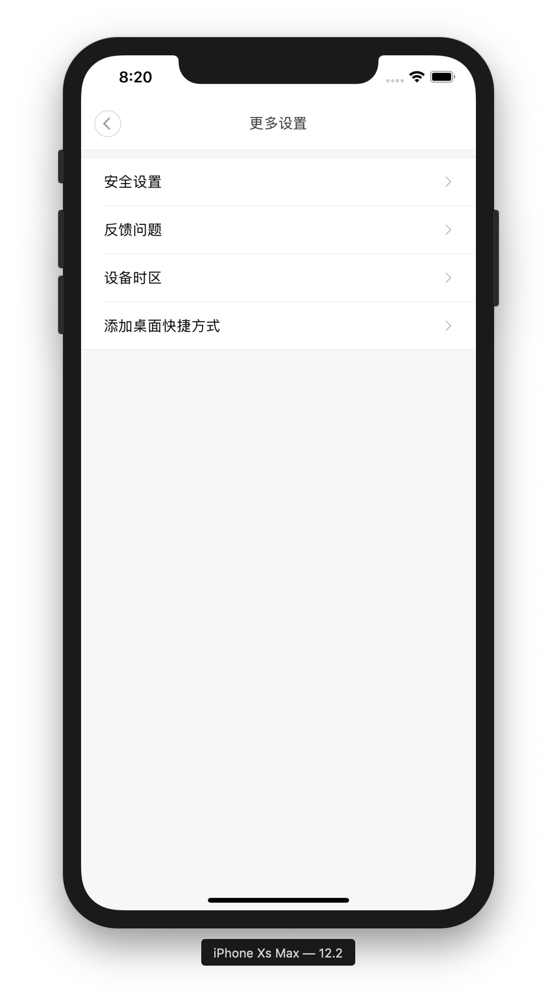

#### 「更多设置」二级页面必选设置项

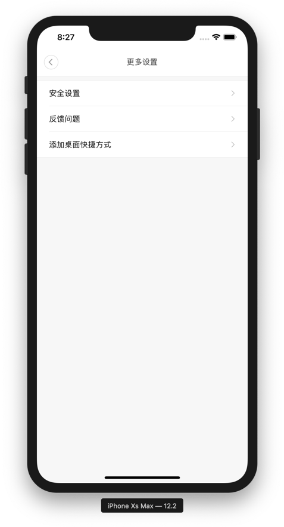

### 基本信息

| 基本信息  |                                                              |
| --------- | ------------------------------------------------------------ |
| 中文名称  | 米家插件通用设置                                             |
| 描述      | 米家插件的通用设置，除了必选项外，可以自定义显示哪些设置项。 |
| 位置      | `miot/ui/CommonSetting/CommonSetting`                        |
| SDK_Level | `SDK_10005`                                                  |
| 注意事项  | 鉴于好多插件开发者**使用不当/直接复制demo**，需要说明的注意事项比较多，详见[详细说明](#详细说明)⬇️ |

#### 详细说明

- 米家PM归纳总结出了米家插件常用的设置项，并且规定了哪些必选，哪些可选。见下表。

  ##### 米家通用设置项速查表

  | key                | 一级               | 分享设备<br />是否显示 | 二级                                                         | 分享设备<br />是否显示 | key                                                          |
  | ------------------ | ------------------ | ---------------------- | ------------------------------------------------------------ | ---------------------- | ------------------------------------------------------------ |
  | `NAME`             | 设备名称(**必选**) | ❌                      | \                                                            |                        | \                                                            |
  | `LOCATION`         | 位置管理(**必选**) | ❌                      | \                                                            |                        | \                                                            |
  | `MEMBER_SET`       | 按键设置(*可选*)   | ❌                      | \                                                            |                        | \                                                            |
  | `SHARE`            | 设备共享(*可选*)   | ❌                      | \                                                            |                        | \                                                            |
  | `BTGATEWAY`        | 蓝牙网关(*可选*)   | ❌                      | \                                                            |                        | \                                                            |
  | `VOICE_AUTH`       | 语音授权(*可选*)   | ❌                      | \                                                            |                        | \                                                            |
  | `IFTTT`            | 智能场景(*可选*)   | ❌                      | \                                                            |                        | \                                                            |
  | `FIRMWARE_UPGRADE` | 固件升级(*可选*)   | ❌                      | \                                                            |                        | \                                                            |
  | `MORE`             | 更多设置(**必选**) | ✅                      | 安全设置(**必选**)<br />反馈问题(**必选**)<br />设备时区(*可选*)<br />添加桌面快捷方式(**必选**) | ❌<br />✅<br />✅<br />✅ | `SECURITY`<br />`FEEDBACK`<br />`TIMEZONE`<br />`ADD_TO_DESKTOP` |
  | `HELP`             | 使用帮助(**必选**) | ✅                      | \                                                            |                        | \                                                            |
  | `LEGAL_INFO`       | 法律信息(**必选**) | ❌                      | \                                                            |                        | \                                                            |
  | \                  | 删除设备(**必选**) | ✅                      | \                                                            |                        | \                                                            |

- 插件设置页面一般包含`功能设置`和`通用设置`：`通用设置`放在页面下半部分，直接引用此组件即可;`功能设置`放在页面上半部分，主要显示通用设置项之外的，和插件功能强相关的设置项，可以考虑使用[ListItem](#普通列表项ListItem)、[ListItemWithSwitch](#带开关的列表项ListItemWithSwitch)和[ListItemWithSlider](#带滑动条的列表项ListItemWithSlider) 这些UI组件。
- 使用时用数组传入要展示的可选项key即可，数组内key的顺序代表可选项从上往下的展示顺序。如果不传，则显示全部设置项，如果传🈳️数组则显示必选项。详见[使用方法](#使用方法-5)⬇️。
- **必选项的位置固定**，不需要传入key，即使传入也不会改变它是否显示以及位置。
- 组建内部已经做了国际化，适配米家所有的语种，毋需开发者另外配置。
- 对于分享设备（普通分享/分享给家人）应该展示哪些设置项，组件内部也已经实现了控制，毋需开发者另外配置。其中，一级只显示「更多设置」、「使用帮助」和「删除设备」，「更多设置」的二级页面则屏蔽了「安全设置」。详见[米家通用设置项速查表](#米家通用设置项速查表)⬆️。
- 通用设置项中「设备名称」和「设备时区」的修改展示逻辑，组件内部已实现，毋需开发者另外配置。
- 点击设置项跳转到米家原生页面后，`android`和`iOS`的UI展示可能不完全一致，米家APP的同事正在排期开发，不要慌也不要催。
- 鉴于蓝牙设备的固件升级页面需要在插件内自己实现，而`Wi-Fi`设备的固件升级可以直接跳转到原生页面。所以组件允许插件开发者自定义「固件升级」的路由跳转。
- 为了能够成功路由到`更多设置`二级页面，需要将`更多设置`页面导出，放在插件入口文件的`RootStack`中，并将插件的路由导航传给组件。详见[使用方法](#使用方法-5)⬇️。
- 二级页面的key现在包含`AUTO_UPGRADE`（固件自动升级）、`TIMEZONE`（设备时区）、`USER_EXPERIENCE_PROGRAM`（加入用户体验计划）。目前只有`TIMEZONE`有效，其余两个可以先忽略。
- 虽然此组件从`SDK_10005`开始可用，但是由于产品定义的迭代，所以上述说明以`SDK_10011`最新代码为准，之前的版本可能稍微有些出入，但出入很小，不必惊讶。

### 使用方法

```jsx
// 入口文件 index.js
// 把「更多设置」页面放在路由堆栈中
import { MoreSetting } from "miot/ui/CommonSetting";

//...

const RootStack = createStackNavigator(
{
  Setting, // 设置页
  MoreSetting, // 更多设置
}
//...
)
```

```jsx
// 设置页 Setting.js
import { CommonSetting, SETTING_KEYS } from "miot/ui/CommonSetting";

// ...

render() {
    const { first_options, second_options } = SETTING_KEYS; // 一级和二级可选项的keys
    // 按顺序显示「设备共享」「智能场景」和「固件升级」
    // 通过枚举传入key，别自己写字符串
    const firstOptions = [
      first_options.SHARE,
      first_options.IFTTT,
      first_options.FIRMWARE_UPGRADE,
    ]
    // 「更多设置」二级页面需要显示「设备时区」
    const secondOptions = [
      second_options.TIMEZONE,
    ]
    // 写法之一 蓝牙设备
    const extraOptions = {
      showUpgrade: false, // 不跳转到原生的固件升级页面
      upgradePageKey: 'MyCustomPage', // 跳转到自己写的页面，传入该页面在 RootStack 中定义的 key
      licenseUrl: require('../resources/html/license_zh.html'), // 用户协议的资源，必填
      policyUrl: require('../resources/html/privacy_zh.html'), // 隐私政策的资源，必填
      deleteDeviceMessage: '真的要删除？你不再考虑考虑？' // 删除设备的提示语，选填
    }
    // 写法之二 Wi-Fi设备
    const extraOptions = {
      // showUpgrade: true, // 跳转到原生的固件升级页面，也可以不写，是默认行为
      licenseUrl: require('../resources/html/license_zh.html'), // 用户协议的资源，必填
      policyUrl: require('../resources/html/privacy_zh.html'), // 隐私政策的资源，必填
    }
    return (
      // ...
      <CommonSetting
        navigation={this.props.navigation} // 插件的路由导航，必填
        firstOptions={firstOptions}
        secondOptions={secondOptions}
        extraOptions={extraOptions}
      />
      // ...
    );
  }
```

### 参数

| Name | Type | Description |
| --- | --- | --- |
| firstOptions | <code>array</code> | 一级可选设置项的keys，keys的顺序代表显示的顺序，不传将显示全部，传空数组将显示必选项 |
| secondOptions | <code>array</code> | 二级可选设置项的keys，keys的顺序代表显示的顺序，不传将显示全部，传空数组将显示必选项 |
| extraOptions | <code>object</code> | 其他特殊配置项，详见[使用方法](#使用方法-5)⬆️。 |
| navigation | <code>object</code> | 必须传入当前插件的路由，即 `this.props.navigation`，否则无法跳转二级页面 |

## 卡片容器(Card)

### 预览

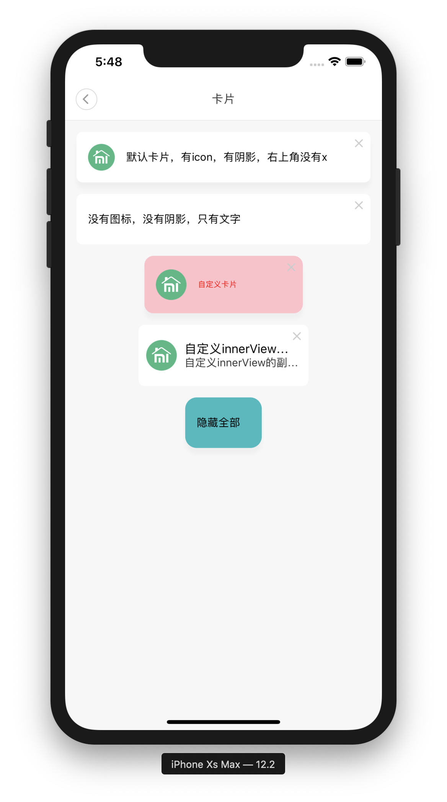

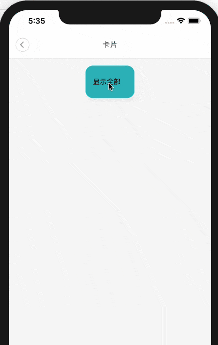

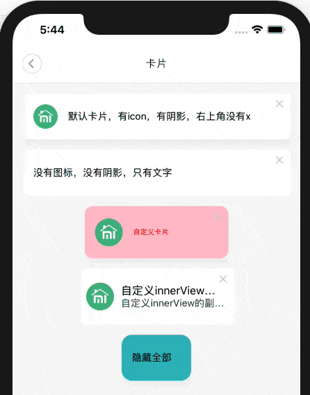

### 基本信息

| 基本信息  |                                                         |
| --------- | ------------------------------------------------------- |
| 中文名称  | 卡片容器                                                |
| 描述      | 卡片容器，有阴影，有弹出和收起动效。                    |
| 位置      | `miot/ui/Card/Card`                                     |
| SDK_Level | `SDK_10010`                                             |
| 说明      | 为了更好地扩展，开发者可以自定义卡片内部视图`innerView` |
| 注意事项  | \                                                       |

### 使用方法

```jsx
// 自定义样式的卡片
<Card
  icon={require('./x/x')}
  text="自定义卡片"
  visible={this.state.visible3}
  dismiss={_ => this.setState({ visible3: false })}
  showDismiss
  onPress={_ => this.setState({ visible2: false })}
  cardStyle={{ width: width / 2, height: 75, borderRadius: 12, backgroundColor: 'pink' }}
  iconStyle={{ width: ICON_SIZE, height: ICON_SIZE }}
  textStyle={{ fontSize: 10, color: 'red' }}
/>

// 自定义内部视图的卡片
<Card
  innerView={this.getInnerView()}
  visible={this.state.visible4}
  dismiss={_ => this.setState({ visible4: false })}
  showShadow={false}
  showDismiss
  onPress={_ => this.setState({ visible3: false })}
  cardStyle={{ width: 222, height: 80 }}
/>

// 插件开发者可以自定义内部视图
getInnerView() {
  return (
    <View style={styles.innerContainer}>
      <Image
        style={styles.innerIcon}
        source={require('./x/x')}
        resizeMode="contain"
      />
      <View style={{ flex: 1 }}>
        <Text
          style={styles.innerTitle}
          numberOfLines={1}
        >
          {'自定义innerView的标题'}
        </Text>
        <Text
          style={styles.innersubTitle}
          numberOfLines={1}
        >
          {'自定义innerView的副标题'}
        </Text>
      </View>
    </View>
  );
}
```

### 参数

| Name          | Type                   | Description                                                  |
| ------------- | ---------------------- | ------------------------------------------------------------ |
| innerView     | <code>component</code> | 卡片内部 View, 不传该参数将显示默认的左 `icon` + 右 `text`   |
| icon          | <code>int</code>       | 左侧图标的资源 id, 参照`Image`的`resource`属性, 不传将不显示图标 |
| text          | <code>string</code>    | 右侧文案                                                     |
| visible       | <code>bool</code>      | 是否显示卡片, 默认值 `true`                                  |
| showDismiss   | <code>bool</code>      | 是否显示右上角的关闭按钮, 默认值 `false`                     |
| dismiss       | <code>function</code>  | 点右上角关闭按钮的回调函数                                   |
| showShadow    | <code>bool</code>      | 是否显示卡片阴影, 默认值 `true`                              |
| onPress       | <code>function</code>  | 点击事件, 不传该参数将显示禁用态                             |
| cardStyle     | <code>style</code>     | 卡片容器的自定义样式, 默认样式 `{ width: screenWidth - 30, height:66 }` |
| iconStyle     | <code>style</code>     | 左侧图标的自定义样式                                         |
| textStyle     | <code>style</code>     | 右侧文案的自定义样式                                         |
| underlayColor | <code>string</code>    | 卡片点击态颜色，默认 `rgba(0,0,0,0.05)`                      |
| shadowColor   | <code>string</code>    | 阴影颜色，默认 `'#000'`，❗️android 平台只支持16进制的 `shadowColor` |
| shadowOpacity | <code>number</code>    | 阴影透明度，默认 `0.03`                                      |

## NormalGear

/**

 \* *@export*

 \* *@author* Geeook

 \* *@since* 10004

 \* *@module* ListItemWithSwitch

 \* *@description* 带开关的列表项

 \* *@property* {string} title - 左侧主标题

 \* *@property* {string} subtitle - 左侧副标题，主标题下方

 \* *@property* {string} valueText - 主标题右侧文案

 \* *@property* {bool} value - 开关状态，默认值 false

 \* *@property* {bool} disabled - 是否禁用开关，默认值 false

 \* *@property* {function} onPress - 列表项点击事件，不传则不具有点击态（disabled）

 \* *@property* {function} onValueChange - 开关切换事件

 \* *@property* {bool} showSeparator - 是否显示分割线，默认值 true

 \* *@property* {component} separator - 自定义分割线，不传将显示默认样式的分割线

 \* *@property* {style} containerStyle - 列表项的自定义样式

 \* *@property* {style} titleStyle - 主标题的自定义样式

 \* *@property* {style} subtitleStyle - 副标题的自定义样式

 \* *@property* {style} valueTextStyle - 主标题右侧文案的自定义样式

 */

## DragGear

/**

 \* *@export*

 \* *@author* Geeook

 \* *@since* 10004

 \* *@module* ListItemWithSwitch

 \* *@description* 带开关的列表项

 \* *@property* {string} title - 左侧主标题

 \* *@property* {string} subtitle - 左侧副标题，主标题下方

 \* *@property* {string} valueText - 主标题右侧文案

 \* *@property* {bool} value - 开关状态，默认值 false

 \* *@property* {bool} disabled - 是否禁用开关，默认值 false

 \* *@property* {function} onPress - 列表项点击事件，不传则不具有点击态（disabled）

 \* *@property* {function} onValueChange - 开关切换事件

 \* *@property* {bool} showSeparator - 是否显示分割线，默认值 true

 \* *@property* {component} separator - 自定义分割线，不传将显示默认样式的分割线

 \* *@property* {style} containerStyle - 列表项的自定义样式

 \* *@property* {style} titleStyle - 主标题的自定义样式

 \* *@property* {style} subtitleStyle - 副标题的自定义样式

 \* *@property* {style} valueTextStyle - 主标题右侧文案的自定义样式

 */

## Radio

/**

 \* *@export*

 \* *@author* Geeook

 \* *@since* 10004

 \* *@module* ListItemWithSwitch

 \* *@description* 带开关的列表项

 \* *@property* {string} title - 左侧主标题

 \* *@property* {string} subtitle - 左侧副标题，主标题下方

 \* *@property* {string} valueText - 主标题右侧文案

 \* *@property* {bool} value - 开关状态，默认值 false

 \* *@property* {bool} disabled - 是否禁用开关，默认值 false

 \* *@property* {function} onPress - 列表项点击事件，不传则不具有点击态（disabled）

 \* *@property* {function} onValueChange - 开关切换事件

 \* *@property* {bool} showSeparator - 是否显示分割线，默认值 true

 \* *@property* {component} separator - 自定义分割线，不传将显示默认样式的分割线

 \* *@property* {style} containerStyle - 列表项的自定义样式

 \* *@property* {style} titleStyle - 主标题的自定义样式

 \* *@property* {style} subtitleStyle - 副标题的自定义样式

 \* *@property* {style} valueTextStyle - 主标题右侧文案的自定义样式

 */

## Checkbox

/**

 \* *@export*

 \* *@author* Geeook

 \* *@since* 10004

 \* *@module* ListItemWithSwitch

 \* *@description* 带开关的列表项

 \* *@property* {string} title - 左侧主标题

 \* *@property* {string} subtitle - 左侧副标题，主标题下方

 \* *@property* {string} valueText - 主标题右侧文案

 \* *@property* {bool} value - 开关状态，默认值 false

 \* *@property* {bool} disabled - 是否禁用开关，默认值 false

 \* *@property* {function} onPress - 列表项点击事件，不传则不具有点击态（disabled）

 \* *@property* {function} onValueChange - 开关切换事件

 \* *@property* {bool} showSeparator - 是否显示分割线，默认值 true

 \* *@property* {component} separator - 自定义分割线，不传将显示默认样式的分割线

 \* *@property* {style} containerStyle - 列表项的自定义样式

 \* *@property* {style} titleStyle - 主标题的自定义样式

 \* *@property* {style} subtitleStyle - 副标题的自定义样式

 \* *@property* {style} valueTextStyle - 主标题右侧文案的自定义样式

 */

## Switch

/**

 \* *@export*

 \* *@author* Geeook

 \* *@since* 10004

 \* *@module* ListItemWithSwitch

 \* *@description* 带开关的列表项

 \* *@property* {string} title - 左侧主标题

 \* *@property* {string} subtitle - 左侧副标题，主标题下方

 \* *@property* {string} valueText - 主标题右侧文案

 \* *@property* {bool} value - 开关状态，默认值 false

 \* *@property* {bool} disabled - 是否禁用开关，默认值 false

 \* *@property* {function} onPress - 列表项点击事件，不传则不具有点击态（disabled）

 \* *@property* {function} onValueChange - 开关切换事件

 \* *@property* {bool} showSeparator - 是否显示分割线，默认值 true

 \* *@property* {component} separator - 自定义分割线，不传将显示默认样式的分割线

 \* *@property* {style} containerStyle - 列表项的自定义样式

 \* *@property* {style} titleStyle - 主标题的自定义样式

 \* *@property* {style} subtitleStyle - 副标题的自定义样式

 \* *@property* {style} valueTextStyle - 主标题右侧文案的自定义样式

 */