# 米家插件通用UI组件手册

## 前言

为了统一米家插件的UI风格，提高插件接入效率，米家插件SDK计划提供给插件开发者一套常用的UI组件，目前正在持续开发输出中。<br />

1. 所有组件的源码在`/miot-sdk/ui/`文件夹下

2. 所有组件的使用方法demo在`/projects/com.xiaomi.demo/Main/UIComponent/`文件夹中

3. 可运行`com.xiaomi.demo`，在「首页」—「UI能力(miot/ui)」页面中查看组件使用效果


4. 为了方便阅读本文档，可以在目录中点击标题直接跳转到组件说明，在组件说明的末尾可点击`「⬆️回到目录」`快速回到目录。另外如果你使用Chrome浏览器，推荐使用插件[Smart TOC](https://chrome.google.com/webstore/detail/smart-toc/lifgeihcfpkmmlfjbailfpfhbahhibba?hl=zh-CN)

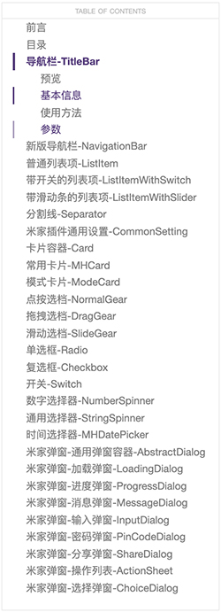

**⚠️SDK_Level指的是从`SDK_XXXXX`开始可以使用该组件**

> 文档难免有疏漏、错误或者和Demo代码不一致的地方，[请不吝指正](https://github.com/MiEcosystem/miot-plugin-sdk/issues/new/choose)。

## 目录

**已完成**🎉

- [导航栏-TitleBar](#导航栏-TitleBar)
- [新版导航栏-NavigationBar](#新版导航栏-NavigationBar)
- [普通列表项-ListItem](#普通列表项-ListItem)
- [带开关的列表项-ListItemWithSwitch](#带开关的列表项-ListItemWithSwitch)
- [带滑动条的列表项-ListItemWithSlider](#带滑动条的列表项-ListItemWithSlider)
- [分割线-Separator](#分割线-Separator)
- [米家插件通用设置-CommonSetting](#米家插件通用设置-CommonSetting)
- [卡片容器-Card](#卡片容器-Card)
- [常用卡片-MHCard](#常用卡片-MHCard)
- [模式卡片-ModeCard](#模式卡片-ModeCard)
- [点按选档-NormalGear](#点按选档-NormalGear)
- [拖拽选档-DragGear](#拖拽选档-DragGear)
- [滑动选档-SlideGear](#滑动选档-SlideGear)
- [单选框-Radio](#单选框-Radio)
- [复选框-Checkbox](#复选框-Checkbox)
- [开关-Switch](#开关-Switch)
- [数字选择器-NumberSpinner](#数字选择器-NumberSpinner)
- [通用选择器-StringSpinner](#通用选择器-StringSpinner)
- [时间选择器-MHDatePicker](#时间选择器-MHDatePicker)
- [米家弹窗-通用弹窗容器-AbstractDialog](#米家弹窗-通用弹窗容器-AbstractDialog)
- [米家弹窗-加载弹窗-LoadingDialog](#米家弹窗-加载弹窗-LoadingDialog)
- [米家弹窗-进度弹窗-ProgressDialog](#米家弹窗-进度弹窗-ProgressDialog)
- [米家弹窗-消息弹窗-MessageDialog](#米家弹窗-消息弹窗-MessageDialog)
- [米家弹窗-输入弹窗-InputDialog](#米家弹窗-输入弹窗-InputDialog)
- [米家弹窗-密码弹窗-PinCodeDialog](#米家弹窗-密码弹窗-PinCodeDialog)
- [米家弹窗-分享弹窗-ShareDialog](#米家弹窗-分享弹窗-ShareDialog)
- [米家弹窗-操作列表-ActionSheet](#米家弹窗-操作列表-ActionSheet)
- [米家弹窗-选择弹窗-ChoiceDialog](#米家弹窗-选择弹窗-ChoiceDialog)
- [空白页面-BlankPage](#空白页面-BlankPage)

**开发中**📝

- 新版导航栏扩展

**计划中**💡

- 插件二级页面常用组件
- 拓展ListItem

***

## 导航栏-TitleBar

### 预览


 ### 基本信息

| 基本信息  |                                        |
| --------- | -------------------------------------- |
| 中文名称  | 导航栏                                 |
| 描述      | 米家通用导航栏，目前正在开发新版导航栏 |
| 位置      | `miot/ui/TitleBar`                     |
| SDK_Level | `SDK_10000`                            |
| 注意事项  | \                                      |

**⚠️SDK_Level指的是从`SDK_XXXXX`开始可以使用该组件**

### 使用方法

```jsx
<TitleBar
  type='light'
  title='title'
  subTitle='subtitle'
  style={{ height: 65, backgroundColor: '#222' }}
  onPressLeft={() => { navigation.goBack() }}
  onPressLeft2={() => console.log('onPressLeft2')}        
  onPressRight={() => { navigation.navigate('moreMenu', { 'title': '设置' }) }}
  onPressRight2={() => console.log('onPressRight2')}
  showDot={this.state.showDot}
/>
```

### 参数

| Name | Type | Description |
| --- | --- | --- |
| type | `string` | 导航栏类型 options: ["dark", "light"(default)], `dark`默认表示白底黑字， `light`默认表示黑底白字 |
| style | `style` | 导航栏整体的样式， 会覆盖 `type`的默认设置 |
| leftTextStyle | `style` | 左侧文字样式，和 `leftText` 一起使用，不设置使用米家默认值 |
| leftText | `string` | 左侧文字 |
| onPressLeft | `func` | 左侧点击事件，设置了才显示左侧文字或图片，如果设置了`leftText`则显示设置的文字，否则显示默认的返回按钮。 |
| onPressLeft2 | `func` | 左侧的第二个点击事件，设置了才显示默认的关闭按钮， |
| rightTextStyle | `style` | 右侧文字样式，和 `rightText` 一起使用，不设置使用米家默认值 |
| rightText | `string` | 右侧文字 |
| onPressRight | `func` | 右侧点击事件，设置了才显示右侧文字或图片，如果设置了 `rightText` 则显示设置的文字，否则显示默认的更多按钮。 |
| onPressRight2 | `func` | 右侧的第二个点击事件，设置了才显示默认的分享按钮 |
| title | `string` | 中间的标题 |
| subTitle | `string` | 中间的子标题 |
| onPressTitle | `func` | 点击标题的事件 |
| showDot | `bool` | 是否显示右侧更多按钮的小红点 |

[⬆️回到目录](#目录)

***

## 新版导航栏-NavigationBar

### 预览

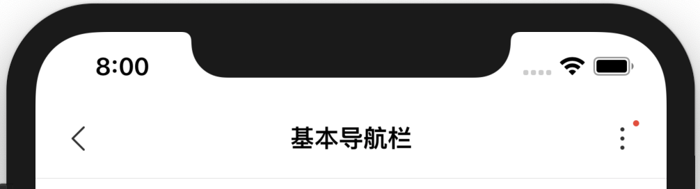

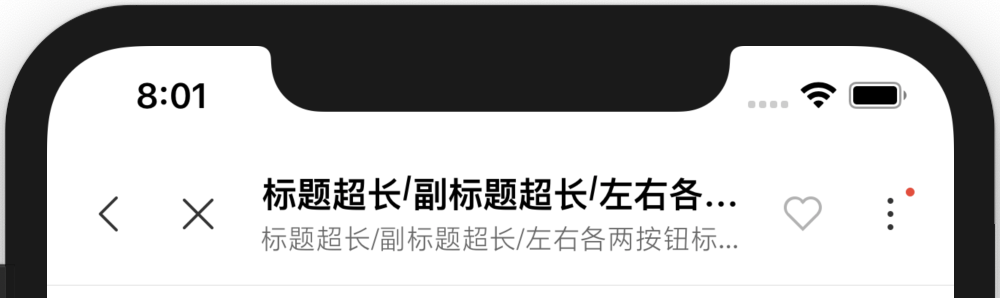

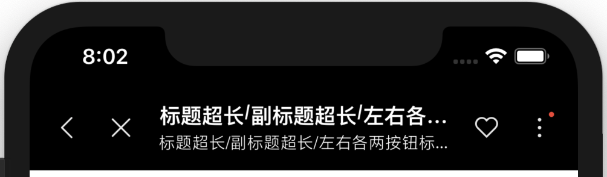

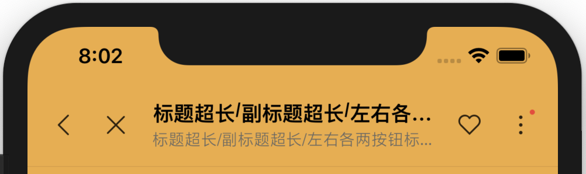

### 基本信息

| 基本信息  |                                                              |
| --------- | ------------------------------------------------------------ |
| 中文名称  | 米家插件导航栏                                               |
| 描述      | 新版的米家插件导航栏，根据最新的米家插件设计规范开发<br />按照设计规范要求，推荐插件开发者使用新版导航栏 |
| 位置      | `miot/ui/NavigationBar`                                      |
| SDK_Level | `SDK_10021`                                                  |
| 注意事项  | \                                                            |

### 使用方法

```jsx
<NavigationBar
  backgroundColor='transparent'
  type={NavigationBar.TYPE.DARK}
  left={[
    {
      key: NavigationBar.ICON.BACK,
      onPress: _ => this.props.navigation.goBack()
    },
    {
      key: NavigationBar.ICON.CLOSE,
      onPress: _ => console.log('onPress')
    }
  ]}
  right={[
    {
      key: NavigationBar.ICON.COLLECT,
      disable: true,
      onPress: _ => console.log('onPress')
    },
    {
      key: NavigationBar.ICON.MORE,
      showDot: this.state.showDot,
      onPress: _ => console.log('onPress')
    }
  ]}
  title='标题'
  subtitle='副标题'
  onPressTitle={_ => console.log('onPressTitle')}
/>
```

### 参数

| Name            | Type                             | Description                                                  |
| --------------- | -------------------------------- | ------------------------------------------------------------ |
| type            | <code>string</code>              | 导航栏类型：<br />`NavigationBar.TYPE.DARK` 表示深色背景白色文字<br />`NavigationBar.TYPE.LIGHT` 相反 |
| backgroundColor | <code>object</code>              | 导航栏背景色                                                 |
| left            | <code>array&lt;object&gt;</code> | 左侧按钮的集合，最多显示两个，多余无效，每个按钮用一个`object`表示<br /> {<br />key // 按钮的key，在`NavigationBar.ICON`中枚举定义<br />disable // 是否禁用按钮<br />showDot // 是否显示小红点<br />onPress // 点击按钮的回调函数<br />} |
| right           | <code>array&lt;object&gt;</code> | 右侧按钮的集合，最多显示两个，多余无效，每个按钮用一个`object`表示 `{ key, disable, showDot, onPress }` |
| title           | <code>string</code>              | 中间的标题                                                   |
| subtitle        | <code>string</code>              | 中间的副标题                                                 |
| onPressTitle    | <code>string</code>              | 点击标题的事件                                               |

### NavigationBar.ICON 图标列表

| 枚举值                            | 中文描述      | 图标                                           |
| --------------------------------- | ------------- | ---------------------------------------------- |
| `NavigationBar.ICON.ADD`          | 添加          | 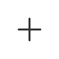          |
| `NavigationBar.ICON.BACK`         | 返回          |          |
| `NavigationBar.ICON.CLOSE`        | 关闭          |         |
| `NavigationBar.ICON.COLLECT`      | 收藏/喜欢     |       |
| `NavigationBar.ICON.COMPLETE`     | 完成/确认     |      |
| `NavigationBar.ICON.DELETE`       | 删除          |        |
| `NavigationBar.ICON.DETAIL`       | 详情          |        |
| `NavigationBar.ICON.MORE`         | 更多          | 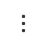         |
| `NavigationBar.ICON.NEXT`         | 下一步/下一页 |          |
| `NavigationBar.ICON.PROFILE`      | 个人中心/我的 |       |
| `NavigationBar.ICON.QR`           | 二维码/扫一扫 |            |
| `NavigationBar.ICON.SEARCH`       | 搜索          |        |
| `NavigationBar.ICON.SELECT_ALL`   | 全选          |    |
| `NavigationBar.ICON.SELECTED_ALL` | 全部选中      |  |
| `NavigationBar.ICON.SHARE`        | 分享          |         |

### 和`Titlebar` 对比

- 在原有图标基础上支持更多的图标（共16种），但不支持自定义图标，只能从 [NavigationBar.ICON](#navigationbaricon-图标列表) 中选择，图标样式也有改动
- 传参有改动，删除 `leftTextStyle/leftText/rightTextStyle/rightText/style`，增加 `left/right/backgroundColor`
- `type` 含义变更：之前 `dark` 表示白底黑字，容易误导，现在表示**深色背景白色文字**
- 考虑到某些语言不好兼容的情况，导航栏左右侧只支持图标，不再支持文字
- 导航栏高度固定，不允许更改，背景色仍然可以自定义

[⬆️回到目录](#目录)

***

## 普通列表项-ListItem

### 预览


### 基本信息

| 基本信息  |                                                              |
| --------- | ------------------------------------------------------------ |
| 中文名称  | 普通列表项                                                   |
| 描述      | 常用的列表项，带有右箭头（可隐藏），可设置标题/副标题/右侧文字 |
| 位置      | `miot/ui/ListItem/ListItem`                                  |
| SDK_Level | `SDK_10004`                                                  |
| 注意事项  | \                                                            |

### 使用方法

```jsx
<ListItem
  title='自定义样式'
  subtitle='这是用来测试副标题的文案，尽量写长一点争取可以换行。'
  value='这是一段测试右侧文案'
  hideArrow={true}
  showDot={true}
  containerStyle={{ width: width * 0.8, backgroundColor: 'lightblue' }}
  titleStyle={{ fontSize: 17, color: 'red' }}
  subtitleStyle={{ fontSize: 10, color: 'green' }}
  valueStyle={{ fontSize: 10, color: 'yellow' }}
  onPress={_ => console.log(4)}
  separator={<Separator />}
/>
```

### 参数

| Name | Type | Description |
| --- | --- | --- |
| title | <code>string</code> | 左侧主标题 |
| subtitle | <code>string</code> | 右侧副标题 |
| value | <code>string</code> | 右侧文案 |
| onPress | <code>function</code> | 点击事件 |
| disabled | <code>bool</code> | 是否禁用点击，默认值 `false` |
| showSeparator | <code>bool</code> | 是否显示分割线，默认值 `true` |
| hideArrow | `bool` | 是否隐藏右侧箭头图片，默认值 `false`(`❗️SDK_10020`新增) |
| showDot | `bool` | 是否显示小红点，默认值`false`(`❗️SDK_10021`新增) |
| separator | <code>component</code> | 自定义分割线，不传将显示默认样式的分割线 |
| containerStyle | <code>style</code> | 列表项的自定义样式 |
| titleStyle | <code>style</code> | 标题的自定义样式 |
| subtitleStyle | <code>style</code> | 副标题的自定义样式 |
| valueStyle | <code>style</code> | 右侧文案的自定义样式 |

[⬆️回到目录](#目录)

***

## 带开关的列表项-ListItemWithSwitch

### 预览


### 基本信息

| 基本信息  |                                                            |
| --------- | ---------------------------------------------------------- |
| 中文名称  | 带开关的列表项                                             |
| 描述      | 常用的列表项，右侧带有开关，可设置标题/标题右侧文字/副标题 |
| 位置      | `miot/ui/ListItem/ListItemWithSwitch`                      |
| SDK_Level | `SDK_10004`                                                |
| 注意事项  | \                                                          |

### 使用方法

```jsx
<ListItemWithSwitch
  title='标题测试标题测试标题测试标题测试标题测试标题测试'
  valueText='测试测试测试测试测试测试测试测试测试测试测试'
  subtitle='副标题测试副标题测试副标题测试副标题测试副标题测试副标题测试'
  onPress={_ => console.log('do what u want to do')}
  onValueChange={value => console.log(value)}
  containerStyle={{ width: width * 0.8, backgroundColor: 'lightblue' }}
  titleStyle={{ fontSize: 17, color: 'red' }}
  subtitleStyle={{ fontSize: 10, color: 'green' }}
  valueTextStyle={{ fontSize: 10, color: 'yellow' }}
  separator={<Separator />}
/>
```

### 参数

| Name | Type | Description |
| --- | --- | --- |
| title | <code>string</code> | 左侧主标题 |
| subtitle | <code>string</code> | 左侧副标题，主标题下方 |
| valueText | <code>string</code> | 主标题右侧文案 |
| value | <code>bool</code> | 开关状态，默认值 `false` |
| disabled | <code>bool</code> | 是否禁用开关，默认值 `false` |
| onPress | <code>function</code> | 列表项点击事件，不传则不具有点击态（disabled） |
| onValueChange | <code>function</code> | 开关切换事件 |
| showSeparator | <code>bool</code> | 是否显示分割线，默认值 `true` |
| separator | <code>component</code> | 自定义分割线，不传将显示默认样式的分割线 |
| containerStyle | <code>style</code> | 列表项的自定义样式 |
| titleStyle | <code>style</code> | 主标题的自定义样式 |
| subtitleStyle | <code>style</code> | 副标题的自定义样式 |
| valueTextStyle | <code>style</code> | 主标题右侧文案的自定义样式 |

[⬆️回到目录](#目录)

***

## 带滑动条的列表项-ListItemWithSlider

### 预览


### 基本信息

| 基本信息  |                                                       |
| --------- | ----------------------------------------------------- |
| 中文名称  | 带滑动条的列表项                                      |
| 描述      | 常用的列表项，标题下方有滑动条，可设置标题/滑动条样式 |
| 位置      | `miot/ui/ListItem/ListItemWithSlider`                 |
| SDK_Level | `SDK_10004`                                           |
| 注意事项  | \                                                     |

### 使用方法

```jsx
<ListItemWithSlider
  title='自定义样式的滑动条列表项自定义样式的滑动条列表项'
  sliderProps={{ minimumValue: 25, maximumValue: 75, value: 60 }}
  sliderStyle={{
    minimumTrackTintColor: "red",
    maximumTrackTintColor: "#fff",
    style: { width: width * 0.5, alignSelf: 'center' },
    trackStyle: { height: 4, borderRadius: 2 },
    thumbStyle: { width: 30, height: 30, borderRadius: 15 },
  }}
  containerStyle={{ width: width * 0.8, backgroundColor: 'lightblue' }}
  titleStyle={{ fontSize: 17, color: 'red' }}
  valueStyle={{ fontSize: 10, color: 'yellow' }}
  showWithPercent={false}
  unit={'cal'}
  onValueChange={value => console.log(value)}
  onSlidingComplete={value => console.log(value)}
  separator={<Separator />}
/>
```

### 参数

| Name | Type | Description |
| --- | --- | --- |
| title | <code>string</code> | 标题 |
| sliderProps | <code>object</code> | `slider` 的属性值<br />默认值<br />{<br />  minimumValue:0,<br />  maximumValue:100,<br />  step:1,<br />  value:50<br />}<br />`minimumValue`: 最小值<br />`maximumValue`: 最大值<br />`step`: 步长<br />`value`: 当前值 |
| showWithPercent | <code>bool</code> | 是否以百分比显示当前值，默认值 `true` |
| unit | `string` | 当前值的单位。`showWithPercent = true` 将不显示单位<br />(`❗️SDK_10020`新增) |
| sliderStyle | <code>object</code> | `slider` 的自定义样式<br />默认值<br />{<br />minimumTrackTintColor: "#32BAC0",<br />maximumTrackTintColor: "rgba(0,0,0,0.15)",<br />thumbTintColor: "#32BAC0",<br />style: {},<br />trackStyle: { height: 2, borderRadius: 1 },<br />thumbStyle: { width: 24, height: 24, borderRadius: 12 }<br />}<br />`minimumTrackTintColor`: slider 左侧已填充颜色<br />`maximumTrackTintColor`: slider 右侧未填充颜色<br />`thumbTintColor`: 可移动圆圈的填充颜色<br />`style`: slider 容器的自定义样式<br />`trackStyle`: 轨的自定义样式<br />`thumbStyle`: 可移动圆圈的自定义样式 |
| onValueChange | `function` | 滑动回调函数，返回实时的滑动值(`❗️SDK_10020`新增) |
| onSlidingComplete | <code>function</code> | 滑动结束回调函数 |
| disabled | <code>bool</code> | 是否禁用滑动，默认值 `false` |
| containerStyle | <code>style</code> | 列表项的自定义样式 |
| titleStyle | <code>style</code> | 标题的自定义样式 |
| valueStyle | <code>style</code> | `value`的自定义样式 |
| showSeparator | <code>bool</code> | 是否显示分割线，默认值 `true` |
| separator | <code>component</code> | 自定义分割线，不传将显示默认样式的分割线 |

[⬆️回到目录](#目录)

***

## 分割线-Separator

### 预览


### 基本信息

| 基本信息  |                                                              |
| --------- | ------------------------------------------------------------ |
| 中文名称  | 分割线                                                       |
| 描述      | 细分割线，包括横线和竖线，常用于导航栏和列表项等             |
| 位置      | `miot/ui/Separator`                                          |
| SDK_Level | `SDK_10004`                                                  |
| 说明      | `<View style={{ height: 0.5, width: 300 }} />`的细分割线在`android`和`iOS`平台上显示不一致，于是才有了它。 |
| 注意事项  | 细线的宽度有最大限制(**max = 1**)                            |

### 使用方法

```jsx
<Separator /> // 横细线，充满父组件
<Separator style={{ marginLeft: 24，height: 2 }} /> // 左边距24，height设置2无效
<Separator type='column' /> // 竖细线，充满父组件
```

### 参数

| Name | Type | Description |
| --- | --- | --- |
| type | `string` | 分割线类型，横向`row`或者纵向`column`，默认横向<br />(`❗️SDK_10021`新增) |
| style | <code>style</code> | 自定义样式 |

[⬆️回到目录](#目录)

***

## 米家插件通用设置-CommonSetting

### 预览

#### 一级页面


#### 「更多设置」二级页面


### 基本信息

| 基本信息  |                                                              |
| --------- | ------------------------------------------------------------ |
| 中文名称  | 米家插件通用设置                                             |
| 描述      | 米家插件的通用设置，除了必选项外，可以自定义显示哪些设置项。 |
| 位置      | `miot/ui/CommonSetting/CommonSetting`                        |
| SDK_Level | `SDK_10005`                                                  |
| 注意事项  | 鉴于好多插件开发者**使用不当/直接复制demo**，需要说明的注意事项比较多，详见[详细说明](#详细说明)⬇️ |

### 参数

| Name          | Type                | Description                                                  |
| ------------- | ------------------- | ------------------------------------------------------------ |
| firstOptions  | <code>array</code>  | 一级页面可选设置项的keys，<br />详见[米家通用设置项速查表](#米家通用设置项速查表)⬇️<br />keys的顺序代表显示的顺序，不传将显示全部，传空数组将只显示必选项。 |
| secondOptions | <code>array</code>  | 二级页面可选设置项的keys，<br />详见[米家通用设置项速查表](#米家通用设置项速查表)⬇️<br />二级页面从属于一级页面，目前暂时只有「更多设置」二级页面可以配置可选项「设备时区」，传入该设置项的key就显示该设置项，不传则不显示。 |
| showDot       | `array`             | 定义哪些列表项需要显示小红点。为了便于扩展，每个列表项都可以显示小红点，默认全部**不显示**，某列表项需要小红点，传入该列表项的`key`即可。详见[使用方法](#使用方法-6)⬇️。(`❗️SDK_10021`新增) |
| extraOptions  | <code>object</code> | 其他特殊配置项<br />{<br />showUpgrade // 是否跳转到原生的固件升级页面<br />upgradePageKey // 如果showUpgrade = false，传入想跳转页面的key<br />licenseUrl // 用户协议的资源，将用于「法律信息」二级页面，(`❗️SDK_10023`废弃)<br />policyUrl // 隐私政策的资源，将用于「法律信息」二级页面，(`❗️SDK_10023`废弃)<br />option // 查看隐私政策和用户协议的接口传参，具体见[Host.ui.previewLegalInformationAuthorization](https://github.com/MiEcosystem/miot-plugin-sdk/blob/SDK_10023/miot-sdk/host/ui.js#L189) 的传参说明，之后将废弃掉`licenseUrl`和`policyUrl`，(`❗️SDK_10023`新增)<br />deleteDeviceMessage // 删除设备的提示语，选填<br />}<br />详见[使用方法](#使用方法-6)⬇️。 |
| navigation    | <code>object</code> | 必须传入当前插件的路由，即 `this.props.navigation`，否则无法跳转二级页面 |

#### 详细说明

- 米家PM归纳总结出了米家插件常用的设置项，并且规定了哪些必选，哪些可选。见下表。

  ##### 米家通用设置项速查表

  | key                | 一级               | 分享设备<br />是否显示 | 二级                                                         | 分享设备<br />是否显示 | key                                                          |
  | ------------------ | ------------------ | ---------------------- | ------------------------------------------------------------ | ---------------------- | ------------------------------------------------------------ |
  | `NAME`             | 设备名称(**必选**) | ❌                      | \                                                            |                        | \                                                            |
  | `LOCATION`         | 位置管理(**必选**) | ❌                      | \                                                            |                        | \                                                            |
  | `MEMBER_SET`       | 按键设置(*可选*)   | ❌                      | \                                                            |                        | \                                                            |
  | `SHARE`            | 设备共享(*可选*)   | ❌                      | \                                                            |                        | \                                                            |
  | `BTGATEWAY`        | 蓝牙网关(*可选*)   | ❌                      | \                                                            |                        | \                                                            |
  | `VOICE_AUTH`       | 语音授权(*可选*)   | ❌                      | \                                                            |                        | \                                                            |
  | `IFTTT`            | 智能场景(*可选*)   | ❌                      | \                                                            |                        | \                                                            |
  | `FIRMWARE_UPGRADE` | 固件升级(*可选*)   | ❌                      | \                                                            |                        | \                                                            |
  | `MORE`             | 更多设置(**必选**) | ✅                      | 安全设置(**必选**)<br />反馈问题(**必选**)<br />设备时区(*可选*)<br />添加桌面快捷方式(**必选**) | ❌<br />✅<br />✅<br />✅ | `SECURITY`<br />`FEEDBACK`<br />`TIMEZONE`<br />`ADD_TO_DESKTOP` |
  | `HELP`             | 使用帮助(**必选**) | ✅                      | \                                                            |                        | \                                                            |
  | `LEGAL_INFO`       | 法律信息(**必选**) | ❌                      | \                                                            |                        | \                                                            |
  | \                  | 删除设备(**必选**) | ✅                      | \                                                            |                        | \                                                            |

- 插件设置页面一般包含`功能设置`和`通用设置`：`通用设置`放在页面下半部分，直接引用此组件即可;`功能设置`放在页面上半部分，主要显示通用设置项之外的，和插件功能强相关的设置项，可以考虑使用[ListItem](#普通列表项-ListItem)、[ListItemWithSwitch](#带开关的列表项-ListItemWithSwitch)和[ListItemWithSlider](#带滑动条的列表项-ListItemWithSlider) 这些UI组件。

- 使用时用数组传入要展示的可选项key即可，数组内key的顺序代表可选项从上往下的展示顺序。如果不传，则显示全部设置项，如果传🈳️数组则显示必选项。详见[使用方法](#使用方法-6)⬇️。

- **必选项的位置固定**，不需要传入key，即使传入也不会改变它是否显示以及位置。

- 可选项的相对顺序固定，无法改变。

- 组建内部已经做了国际化，适配米家所有的语种，毋需开发者另外配置。

- 对于分享设备（普通分享/分享给家人）应该展示哪些设置项，组件内部也已经实现了控制，毋需开发者另外配置。其中，一级只显示「更多设置」、「使用帮助」和「删除设备」，「更多设置」的二级页面则屏蔽了「安全设置」。详见[米家通用设置项速查表](#米家通用设置项速查表)⬆️。

- 通用设置项中「设备名称」和「设备时区」的修改展示逻辑，组件内部已实现，毋需开发者另外配置。

- 点击设置项跳转到米家原生页面后，`android`和`iOS`的UI展示可能不完全一致，米家APP的同事正在排期开发，不要慌也不要催。

- **固件升级相关**

  - `Wi-Fi`设备：固件可以更新时，固件升级设置项会显示小红点（无需插件开发者开发），点击后将直接跳转到原生的固件升级页面，在该页面可以查看固件版本，升级固件。配置如下：

    ```js
    const extraOptions = {
      showUpgrade: true
    }
    ```

  - 支持`Mesh`的蓝牙设备：需要**开发者自行实现检查固件升级的逻辑**，如果固件存在更新，则通过`showDot`属性设置「固件升级」显示小红点，点击后将直接跳转到原生的固件升级页面，在该页面可以查看固件版本，升级固件。配置如下：

    ```js
    const extraOptions = {
      showUpgrade: true
    }
    // 如果检查到有固件更新
    const showDot = [
      first_options.FIRMWARE_UPGRADE
    ]
    ```

  - 普通蓝牙设备：和`Mesh`设备一样，需要**开发者自行实现检查固件升级的逻辑**。此外，**需要开发者自行实现固件升级页面**，并将页面的`key`传入通用设置组件，点击后将跳转到自定义的固件升级页面。配置如下：

    ```js
    const extraOptions = {
      showUpgrade: false,
      upgradePageKey: 'FirmwareUpgrade', // 传入自定义的固件升级页面的key，就是在插件入口的RootStack中定义的那个
    }
    // 如果检查到有固件更新
    const showDot = [
      first_options.FIRMWARE_UPGRADE
    ]
    ```

- 为了能够成功路由到`更多设置`二级页面，需要将`更多设置`页面导出，放在插件入口文件的`RootStack`中，并将插件的路由导航传给组件。详见[使用方法](#使用方法-6)⬇️。

- 二级页面的key现在包含`AUTO_UPGRADE`（固件自动升级）、`TIMEZONE`（设备时区）、`USER_EXPERIENCE_PROGRAM`（加入用户体验计划）。目前只有`TIMEZONE`有效，其余两个可以先忽略。

- 虽然此组件从`SDK_10005`开始可用，但是由于产品定义的迭代，所以上述说明以`SDK_10011`最新代码为准，之前的版本可能稍微有些出入，但出入很小，不必惊讶。

- 对于某些十分特殊的设备（比如：灯组），可能需要屏蔽必选的设置项（比如：安全设置），请提issue或者联系相关开发同事。

### 使用方法

```jsx
// 入口文件 index.js
// 把「更多设置」页面放在路由堆栈中
// 为了兼容 <SDK_10011 的版本，需要把「固件升级」页面也放在路由堆栈中
import { FirmwareUpgrade, MoreSetting } from "miot/ui/CommonSetting";

//...

const RootStack = createStackNavigator(
{
  Setting, // 设置页
  MoreSetting, // 更多设置
  FirmwareUpgrade, // 固件升级
}
//...
)
```

```jsx
// 设置页 Setting.js
import { CommonSetting, SETTING_KEYS } from "miot/ui/CommonSetting";

// ...

render() {
    const { first_options, second_options } = SETTING_KEYS; // 一级页面和二级页面可选项的keys
    // 比如我想在一级页面按顺序显示「设备共享」「智能场景」和「固件升级」
    // 通过枚举值 first_options 传入这三个设置项的key
    const firstOptions = [
      first_options.SHARE,
      first_options.IFTTT,
      first_options.FIRMWARE_UPGRADE,
    ]
    // 然后我想在「更多设置」二级页面显示「设备时区」
    const secondOptions = [
      second_options.TIMEZONE,
    ]
    // 然后我想让「智能场景」和「固件升级」显示小红点
    const showDot = [
      first_options.IFTTT,
      first_options.FIRMWARE_UPGRADE
    ]
    // 假如我的设备是一个蓝牙设备，那么写法可以参考下面
    const extraOptions = {
      showUpgrade: false, // 不跳转到原生的固件升级页面
      upgradePageKey: 'MyCustomPage', // 跳转到自己写的页面，传入该页面在 RootStack 中定义的 key
      licenseUrl: require('../resources/html/license_zh.html'), // 用户协议的资源
      policyUrl: require('../resources/html/privacy_zh.html'), // 隐私政策的资源
      deleteDeviceMessage: '真的要删除？你不再考虑考虑？' // 删除设备的提示语，选填
    }

    // 假如我的设备是一个Wi-Fi设备，那么写法可以参考下面
    const extraOptions = {
      // showUpgrade: true, // 跳转到原生的固件升级页面，也可以不写，是默认行为
      licenseUrl: require('../resources/html/license_zh.html'), // 用户协议的资源
      policyUrl: require('../resources/html/privacy_zh.html'), // 隐私政策的资源
      deleteDeviceMessage: '真的要删除？你不再考虑考虑？' // 删除设备的提示语，选填
    }
    return (
      // ...
      <CommonSetting
        navigation={this.props.navigation} // 插件的路由导航，必填！！！
        firstOptions={firstOptions}
        secondOptions={secondOptions}
        showDot={showDot}
        extraOptions={extraOptions}
      />
      // ...
    );
  }
```

[⬆️回到目录](#目录)

***

## 卡片容器-Card

### 预览


### 基本信息

| 基本信息  |                                                         |
| --------- | ------------------------------------------------------- |
| 中文名称  | 卡片容器                                                |
| 描述      | 卡片容器，有阴影，有弹出和收起动效。                    |
| 位置      | `miot/ui/Card/Card`                                     |
| SDK_Level | `SDK_10010`                                             |
| 说明      | 为了更好地扩展，开发者可以自定义卡片内部视图`innerView` |
| 注意事项  | \                                                       |

### 使用方法

```jsx
// 自定义样式的卡片
<Card
  icon={require('./x/x')}
  text="自定义卡片"
  visible={this.state.visible3}
  dismiss={_ => this.setState({ visible3: false })}
  showDismiss
  onPress={_ => this.setState({ visible2: false })}
  cardStyle={{ width: width / 2, height: 75, borderRadius: 12, backgroundColor: 'pink' }}
  iconStyle={{ width: ICON_SIZE, height: ICON_SIZE }}
  textStyle={{ fontSize: 10, color: 'red' }}
/>

// 自定义内部视图的卡片
<Card
  innerView={this.getInnerView()}
  visible={this.state.visible4}
  dismiss={_ => this.setState({ visible4: false })}
  showShadow={false}
  showDismiss
  onPress={_ => this.setState({ visible3: false })}
  cardStyle={{ width: 222, height: 80 }}
/>

// 插件开发者可以自定义内部视图
getInnerView() {
  return (
    <View style={styles.innerContainer}>
      <Image
        style={styles.innerIcon}
        source={require('./x/x')}
        resizeMode="contain"
      />
      <View style={{ flex: 1 }}>
        <Text
          style={styles.innerTitle}
          numberOfLines={1}
        >
          {'自定义innerView的标题'}
        </Text>
        <Text
          style={styles.innersubTitle}
          numberOfLines={1}
        >
          {'自定义innerView的副标题'}
        </Text>
      </View>
    </View>
  );
}
```

### 参数

| Name          | Type                   | Description                                                  |
| ------------- | ---------------------- | ------------------------------------------------------------ |
| innerView     | <code>component</code> | 卡片内部 View, 不传该参数将显示默认的左 `icon` + 右 `text`   |
| icon          | <code>int</code>       | 左侧图标的资源 id, 参照`Image`的`resource`属性, 不传将不显示图标 |
| text          | <code>string</code>    | 右侧文案                                                     |
| visible       | <code>bool</code>      | 是否显示卡片, 默认值 `true`                                  |
| showDismiss   | <code>bool</code>      | 是否显示右上角的关闭按钮, 默认值 `false`                     |
| disabled      | `bool`                 | 是否禁用卡片点击, 默认值 `false`<br />(`❗️SDK_10021`新增)     |
| dismiss       | <code>function</code>  | 点右上角关闭按钮的回调函数                                   |
| showShadow    | <code>bool</code>      | 是否显示卡片阴影, 默认值 `true`                              |
| onPress       | <code>function</code>  | 点击事件, 不传该参数将显示禁用态                             |
| cardStyle     | <code>style</code>     | 卡片容器的自定义样式, 默认样式 `{ width: screenWidth - 30, height:66 }` |
| iconStyle     | <code>style</code>     | 左侧图标的自定义样式                                         |
| textStyle     | <code>style</code>     | 右侧文案的自定义样式                                         |
| underlayColor | <code>string</code>    | 卡片点击态颜色，默认 `rgba(0,0,0,0.05)`                      |
| shadowColor   | <code>string</code>    | 阴影颜色，默认 `'#000'`，❗️android 平台只支持16进制的 `shadowColor` |
| shadowOpacity | <code>number</code>    | 阴影透明度，默认 `0.03`                                      |

[⬆️回到目录](#目录)

***

## 常用卡片-MHCard

### 预览

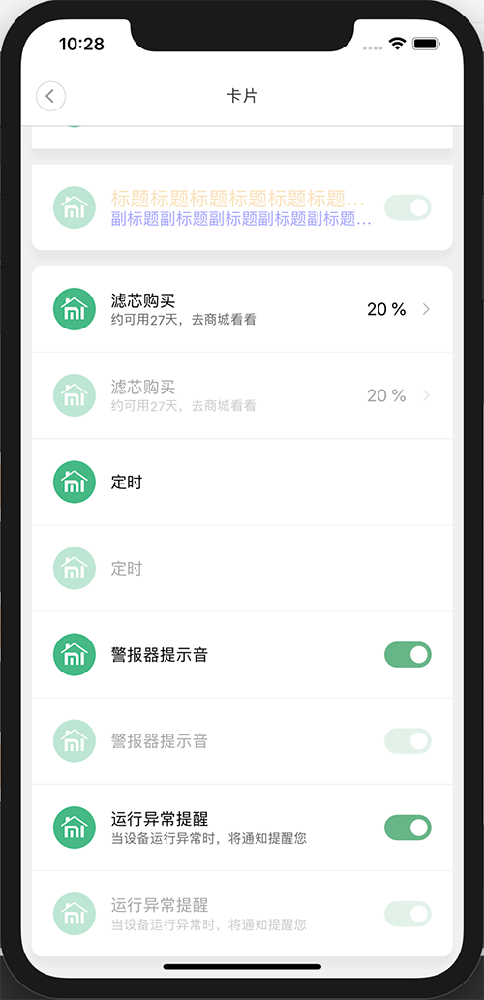

### 基本信息

| 基本信息  |                                                              |
| --------- | ------------------------------------------------------------ |
| 中文名称  | 常用卡片                                                     |
| 描述      | 基于卡片容器开发的米家插件常用的功能卡片，有阴影，有弹出和收起动效。 |
| 位置      | `miot/ui/Card/MHCard`                                        |
| SDK_Level | `SDK_10021`                                                  |
| 说明      | 可以通过设置卡片四角的圆角，把小卡片拼接成一个大的卡片List，详见[使用方法](#使用方法-8)⬇️。 |
| 注意事项  | \                                                            |

### 使用方法

```jsx
// 右侧文字 + 箭头
<MHCard
  title='标题标题标题标题标题标题标题标题标题标题标题标题标题标题标题'
  titleStyle={{ color: '#f0ac3d', fontSize: 18 }}
  subtitle='副标题副标题副标题副标题副标题副标题副标题副标题副标题副标题副标题'
  subtitleStyle={{ color: 'blue', fontSize: 15 }}
  rightText='测试测试测试测试测试测试测试测试测试'
  rightTextStyle={{ color: '#f43f31', fontSize: 13 }}
  cardType={MHCard.CARD_TYPE.NORMAL}
  cardRadiusType={MHCard.CARD_RADIUS_TYPE.ALL}
  onPress={_ => console.log('onPress')}
  showShadow={true}
  visible={this.state.visible5}
  marginTop={15}
/>

// 右侧开关
<MHCard
  title='标题标题标题标题标题标题标题标题标题标题标题标题标题标题标题'
  titleStyle={{ color: '#f0ac3d', fontSize: 18 }}
  subtitle='副标题副标题副标题副标题副标题副标题副标题副标题副标题副标题副标题'
  subtitleStyle={{ color: 'blue', fontSize: 15 }}
  cardType={MHCard.CARD_TYPE.SWITCH}
  cardRadiusType={MHCard.CARD_RADIUS_TYPE.NONE}
  onValueChange={value => console.log(value)}
  onPress={_ => console.log('onPress')}
  switchValue={this.state.value}
  tintColor='#666'
  onTintColor='#67b688'
  showShadow={true}
  marginTop={15}
/>

// 拼接成卡片List
<MHCard
  title='滤芯购买'
  subtitle='约可用27天，去商城看看'
  rightText='20 %'
  marginTop={15}
  cardType={MHCard.CARD_TYPE.NORMAL}
  cardRadiusType={MHCard.CARD_RADIUS_TYPE.TOP} // 上圆角
  onPress={_ => console.log('onPress')}
/>
<Separator style={{ height: 0.75 }} />
<MHCard
  title='警报器提示音'
  onValueChange={value => console.log(value)}
  switchValue={this.state.value}
  onTintColor='#67b688'
  cardType={MHCard.CARD_TYPE.SWITCH}
  cardRadiusType={MHCard.CARD_RADIUS_TYPE.NONE} // 无圆角
/>
<Separator style={{ height: 0.75 }} />
<MHCard
  title='运行异常提醒'
  subtitle='当设备运行异常时，将通知提醒您'
  disabled={true}
  switchValue={this.state.value}
  onTintColor='#67b688'
  onValueChange={value => console.log(value)}
  cardType={MHCard.CARD_TYPE.SWITCH}
  showShadow={true}
  cardRadiusType={MHCard.CARD_RADIUS_TYPE.BOTTOM}
/>
```

### 参数

#### CARD\_TYPE(卡片类型)

| Name   | Type                | Value                           | Description                |
| ------ | ------------------- | ------------------------------- | -------------------------- |
| NORMAL | <code>string</code> | <code>&quot;normal&quot;</code> | 普通卡片，卡片右侧不是开关 |
| SWITCH | <code>string</code> | <code>&quot;switch&quot;</code> | 开关卡片，卡片右侧是开关   |

#### CARD\_RADIUS\_TYPE(卡片圆角类型)

| Name   | Type                | Value                           | Description      |
| ------ | ------------------- | ------------------------------- | ---------------- |
| ALL    | <code>string</code> | <code>&quot;all&quot;</code>    | 四角都是圆角     |
| NONE   | <code>string</code> | <code>&quot;none&quot;</code>   | 四角都是直角     |
| TOP    | <code>string</code> | <code>&quot;top&quot;</code>    | 上方圆角下方直角 |
| BOTTOM | <code>string</code> | <code>&quot;bottom&quot;</code> | 上方直角下方圆角 |

| Param          | Type                                                 | Description                                                  |
| -------------- | ---------------------------------------------------- | ------------------------------------------------------------ |
| cardType       | [<code>CARD\_TYPE</code>](#card_type卡片类型)                | 卡片类型，右侧是否是开关，默认是 `CARD_TYPE.NORMAL`          |
| cardRadiusType | [<code>CARD\_RADIUS\_TYPE</code>](#card_radius_type卡片圆角类型) | 卡片圆角类型，定义四个角是圆角还是直角，默认是 `CARD_RADIUS_TYPE.ALL`，所有的卡片类型有效 |
| iconContainerStyle | <code>style</code> | 图标容器的样式 |
| icon | <code>number</code> | 左侧图标的资源 id, 参照`Image`的`resource`属性，所有的卡片类型有效 |
| iconStyle | <code>style</code> | 图标的样式 |
| title          | <code>string</code>                                  | 左侧主标题，所有的卡片类型有效                               |
| titleStyle     | <code>style</code>                                   | 左侧主标题的自定义样式，所有的卡片类型有效                   |
| subtitle       | <code>string</code>                                  | 左侧副标题，如果有的话，显示在主标题的下方，没有则不显示，所有的卡片类型有效 |
| subtitleStyle  | <code>style</code>                                   | 左侧副标题的自定义样式，所有的卡片类型有效                   |
| rightText      | <code>string</code>                                  | 右侧文案，如果有的话，显示在右箭头的左侧，没有则不显示，当卡片类型是`CARD_TYPE.NORMAL`有效 |
| rightTextStyle | <code>style</code>                                   | 右侧文案的自定义样式，当卡片类型是`CARD_TYPE.NORMAL`有效     |
| hideArrow      | <code>bool</code>                                    | 是否隐藏右侧箭头图片，默认值 `false`，当卡片类型是`CARD_TYPE.NORMAL`有效 |
| onPress        | <code>function</code>                                | 点击卡片的回调函数，所有的卡片类型有效                       |
| switchValue    | <code>bool</code>                                    | 开关的状态，默认是 `false`，当卡片类型是`CARD_TYPE.SWITCH`有效 |
| onTintColor    | <code>string</code>                                  | 开关打开时的背景颜色，当卡片类型是`CARD_TYPE.SWITCH`有效     |
| tintColor      | <code>string</code>                                  | 开关关闭时的背景颜色，当卡片类型是`CARD_TYPE.SWITCH`有效     |
| onValueChange  | <code>function</code>                                | 点击卡片开关的回调函数，当卡片类型是`CARD_TYPE.SWITCH`有效   |
| disabled       | <code>bool</code>                                    | 是否禁用卡片，默认是 `false`，禁用时显示不可点击态，所有的卡片类型有效 |
| visible        | <code>bool</code>                                    | 是否显示卡片，默认是 `true`，改变该值将显示/隐藏卡片，有弹出和收起动效，所有的卡片类型有效 |
| showShadow     | <code>bool</code>                                    | 是否显示卡片阴影，默认是 `false`，所有的卡片类型有效         |
| marginTop      | <code>number</code>                                  | 卡片的上边距，默认 `0`，所有的卡片类型有效                   |

[⬆️回到目录](#目录)

***

## 模式卡片-ModeCard

### 预览

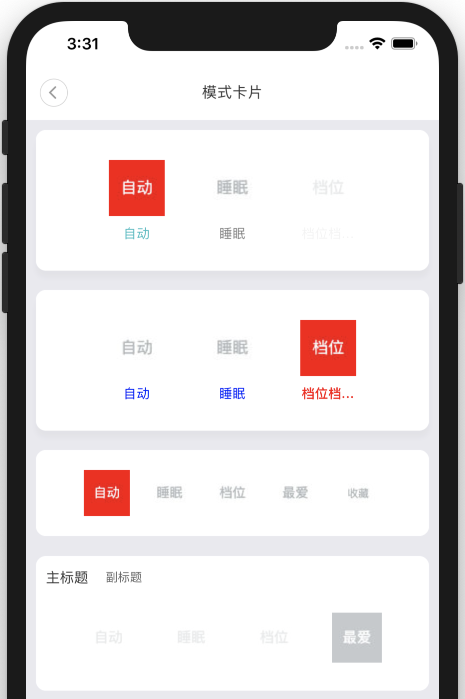

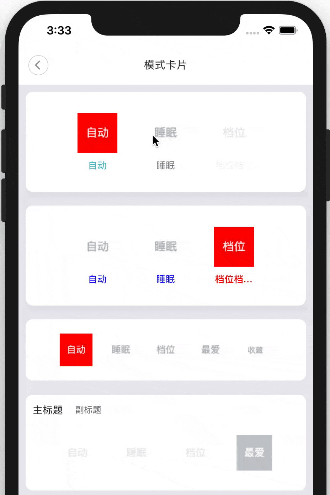

### 基本信息

| 基本信息  |                                                              |
| --------- | ------------------------------------------------------------ |
| 中文名称  | 模式卡片                                                     |
| 描述      | 此卡片用于3-5个属于同一级别和类别的功能或模式逻辑下，只能选中其中一个。 |
| 位置      | `miot/ui/ModeCard`                                           |
| SDK_Level | `SDK_10021`                                                  |
| 说明      | 可以设置卡片的圆角类型，与标题拼接在一起。可以设置是否显示阴影，模式3、4可以添加描述。详见[使用方法](#使用方法-9)⬇️。 |
| 注意事项  | 由于安卓的阴影显示存在问题，在和标题进行卡片拼接时，不能显示阴影，`showShadow` 属性请传入 `false`。 |

### 使用方法

```jsx
// 无标题
<ModeCard
  modes={modes3}
  pressIn={this.pressInDemo}
  pressOut={this.pressOutDemo}
  modesKey='modes3'
  descriptionStyle={{
    color: 'blue',
  }}
  activeDescriptionStyle={{
    color: 'red',
    fontWeight: '700'
  }}
  modeCardStyle={{
    marginTop: 20,
  }}
/>

// 有标题
<View style={styles.cardTop}>
  <Text style={styles.title}>主标题</Text>
  <Text style={styles.subtitle}>副标题</Text>
</View>
<ModeCard
  modes={modes2}
  pressIn={this.pressInDemo}
  pressOut={this.pressOutDemo}
  modesKey='modes2'
  radiusType='bottom'
  showShadow={false}
/>
```

### 参数

#### CARD\_RADIUS\_TYPE(卡片圆角类型)

| Name   | Type                | Value                           | Description      |
| ------ | ------------------- | ------------------------------- | ---------------- |
| ALL    | <code>string</code> | <code>&quot;all&quot;</code>    | 四角都是圆角     |
| NONE   | <code>string</code> | <code>&quot;none&quot;</code>   | 四角都是直角     |
| TOP    | <code>string</code> | <code>&quot;top&quot;</code>    | 上方圆角下方直角 |
| BOTTOM | <code>string</code> | <code>&quot;bottom&quot;</code> | 上方直角下方圆角 |

| Param                  | Type                                                         | Description                                                  |
| ---------------------- | ------------------------------------------------------------ | ------------------------------------------------------------ |
| modes                  | <code>array</code>                                           | 模式数组，默认值：`[]`                                       |
| radiusType             | [<code>CARD\_RADIUS\_TYPE</code>](#card_radius_type卡片圆角类型-1) | 卡片圆角类型，定义四个角是圆角还是直角，默认是 `CARD_RADIUS_TYPE.ALL`，所有的卡片类型有效 |
| pressIn                | <code>function</code>                                        | 按下模式时执行的函数，默认值：`function(){}`                 |
| pressOut               | <code>function</code>                                        | 手指抬起模式时执行的函数，默认值：`function(){}`             |
| modesKey               | <code>string</code>                                          | 模式数组对应的 key，默认值：`''`                             |
| descriptionStyle       | <code>style</code>                                           | 描述文字的样式，默认值：`{}`                                 |
| activeDescriptionStyle | <code>style</code>                                           | 描述文字的高亮样式，默认值：`{}`                             |
| showShadow             | <code>bool</code>                                            | 是否显示卡片阴影, 默认值 `true`。由于安卓的阴影显示存在问题，在和标题进行卡片拼接时，不能显示阴影，请传入 `false` |
| modeCardStyle          | <code>style</code>                                           | 模式卡片样式, 默认值 `{}`                                    |

[⬆️回到目录](#目录)

***

## 点按选档-NormalGear

### 预览


### 基本信息

| 基本信息  |                                                              |
| --------- | ------------------------------------------------------------ |
| 中文名称  | 点按选档                                                     |
| 描述      | 点击不同选项中某一项进行选择，无动效。<br />适用于电暖器、净化器的档位切换。 |
| 位置      | `miot/ui/Gear/NormalGear`                                    |
| SDK_Level | `SDK_10011`                                                  |
| 注意事项  | \                                                            |

### 使用方法

```jsx
<NormalGear
  options={['off', '1', '2', '3', '4', '5']}
  normalStyle={{ width: 60 }}
  margin={20}
  selectColor={'green'}
  textStyle={{ fontSize: 16, fontFamily: 'DS-Digital' }}
  maxWidth={width}
  selectIndex={this.state.selectIndex}
  onSelect={index => console.log(`select${index}`)}
  containerStyle={{ backgroundColor: '#fff' }}
/>
```

### 参数

| Name           | Type                             | Description                                                  |
| -------------- | -------------------------------- | ------------------------------------------------------------ |
| options        | <code>array&lt;string&gt;</code> | 档位可选项，以字符串数组表示，必填。<br />❗️每项文字尽量精简  |
| margin         | <code>number</code>              | 档位选项之间的间距，默认 `12`, 示意图 \|12⭕️12⭕️12\|           |
| maxWidth       | <code>number</code>              | 容器宽度最大值，不传则默认屏幕宽度。 如果所有档位的宽度 + 间距占据的宽度 <= `maxWidth`，则取实际宽度； 否则容器宽度取 `maxWidth`，各个档位的宽度和间距自适应减小。 |
| containerStyle | <code>style</code>               | 容器样式，设置宽高无效                                       |
| normalStyle    | <code>style</code>               | 普通档位样式，如果没有设置宽高，则默认宽高为 `50`            |
| textStyle      | <code>style</code>               | 档位文字的样式                                               |
| selectColor    | <code>string</code>              | 被选择档位的背景色                                           |
| selectIndex    | <code>number</code>              | 被选择档位的数组下标                                         |
| onSelect       | <code>function</code>            | 选择某档位后的回调函数                                       |

[⬆️回到目录](#目录)

***

## 拖拽选档-DragGear

### 预览


### 基本信息

| 基本信息  |                                                              |
| --------- | ------------------------------------------------------------ |
| 中文名称  | 拖拽选档                                                     |
| 描述      | 使用拖拽手势或者直接点击从不同选项中选择一项，有动效。<br />适用于电暖器、净化器的档位切换。 |
| 位置      | `miot/ui/Gear/DragGear`                                      |
| SDK_Level | `SDK_10011`                                                  |
| 注意事项  | \                                                            |

### 使用方法

```jsx
// 参数和 NormalGear 一致
<DragGear
  options={['off', '1', '2', '3', '4', '5']}
  normalStyle={{ width: 60 }}
  margin={20}
  selectColor={'green'}
  textStyle={{ fontSize: 16, fontFamily: 'DS-Digital' }}
  maxWidth={width}
  selectIndex={this.state.selectIndex}
  onSelect={index => console.log(`select${index}`)}
  containerStyle={{ backgroundColor: '#fff' }}
/>
```

### 参数

| Name           | Type                             | Description                                                  |
| -------------- | -------------------------------- | ------------------------------------------------------------ |
| options        | <code>array&lt;string&gt;</code> | 档位可选项，以字符串数组表示，必填。<br />❗️每项文字尽量精简  |
| margin         | <code>number</code>              | 档位选项之间的间距，默认 `12`, 示意图 \|12⭕️12⭕️12\|           |
| maxWidth       | <code>number</code>              | 容器宽度最大值，不传则默认屏幕宽度。 如果所有档位的宽度 + 间距占据的宽度 <= `maxWidth`，则取实际宽度； 否则容器宽度取 `maxWidth`，各个档位的宽度和间距自适应减小。 |
| containerStyle | <code>style</code>               | 容器样式，设置宽高无效                                       |
| normalStyle    | <code>style</code>               | 普通档位样式，如果没有设置宽高，则默认宽高为 `50`            |
| textStyle      | <code>style</code>               | 档位文字的样式                                               |
| selectColor    | <code>string</code>              | 被选择档位的背景色                                           |
| selectIndex    | <code>number</code>              | 被选择档位的数组下标                                         |
| onSelect       | <code>function</code>            | 选择某档位后的回调函数                                       |

[⬆️回到目录](#目录)

***

## 滑动选档-SlideGear

### 预览

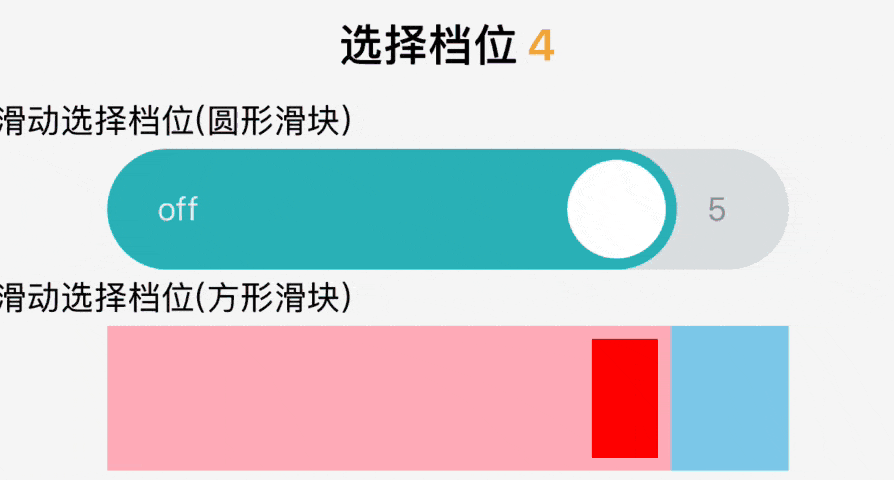

### 基本信息

| 基本信息  |                                                              |
| --------- | ------------------------------------------------------------ |
| 中文名称  | 滑动选档                                                     |
| 描述      | 类似于Slider，使用滑动手势选择具体值。<br />适用于一段范围的选值或者较多档位的切换。 |
| 位置      | `miot/ui/Gear/SlideGear`                                     |
| SDK_Level | `SDK_10022`                                                  |
| 注意事项  | \                                                            |

### 使用方法

```jsx
<Text style={styles.label}>
  {`滑动选择档位(圆形滑块)`}
</Text>
<SlideGear
  options={this.options}
  value={this.state.selectIndex}
  containerStyle={{ width: width * 0.75 }}
  onValueChange={index => this.callback(index)}
  onSlidingComplete={index => this.callback(index)}
/>
<Text style={styles.label}>
  {`滑动选择档位(方形滑块)`}
</Text>
<SlideGear
  type={SlideGear.TYPE.RECTANGLE}
  options={this.options}
  showEndText={false}
  containerStyle={{ width: width * 0.75, height: 66 }}
  blockStyle={{ width: 30, backgroundColor: 'red' }}
  minimumTrackTintColor='lightpink'
  maximumTrackTintColor='skyblue'
  value={this.state.selectIndex}
  onValueChange={index => this.callback(index)}
  onSlidingComplete={index => this.callback(index)}
/>
```

### 参数

#### TYPE(容器和滑块的圆角类型)

| Name      | Type                | Value                              | Description |
| --------- | ------------------- | ---------------------------------- | ----------- |
| CIRCLE    | <code>string</code> | <code>&quot;circle&quot;</code>    | 圆形 ⭕️      |
| RECTANGLE | <code>string</code> | <code>&quot;rectangle&quot;</code> | 方形 ⬜️      |

| Name                  | Type                                           | Description                                                  |
| --------------------- | ---------------------------------------------- | ------------------------------------------------------------ |
| type                  | [<code>TYPE</code>](#type容器和滑块的圆角类型) | 容器和滑块的圆角类型                                         |
| options               | <code>array&lt;string&gt;</code>               | 档位可选项，以字符串数组表示，必填                           |
| showEndText           | <code>bool</code>                              | 是否显示两端的文字，即`options`的第一个和最后一个，默认`true` |
| containerStyle        | <code>style</code>                             | 容器样式，设置背景颜色无效                                   |
| blockStyle            | <code>style</code>                             | 滑块样式，尺寸始终比容器小                                   |
| minimumTrackTintColor | <code>string</code>                            | 滑块左侧填充颜色                                             |
| leftTextColor         | <code>string</code>                            | 最左侧文字颜色，`showEndText = true`时有效                   |
| maximumTrackTintColor | <code>string</code>                            | 滑块右侧填充颜色                                             |
| rightTextColor        | <code>string</code>                            | 最右侧文字颜色，`showEndText = true`时有效                   |
| value                 | <code>number</code>                            | 被选择档位的数组下标, `0<=value<=options.length -1`          |
| disabled              | `boolean`                                      | 是否禁用交互，默认`false`(`❗️SDK_10023`新增)                  |
| onValueChange         | <code>function</code>                          | 滑动时的回调函数                                             |
| onSlidingComplete     | <code>function</code>                          | 滑动结束的回调函数                                           |

[⬆️回到目录](#目录)

***

## 单选框-Radio

### 预览


### 基本信息

| 基本信息  |                                                              |
| --------- | ------------------------------------------------------------ |
| 中文名称  | 单选框                                                       |
| 描述      | 就像网页上的单选按钮一样，点击某一项就能把它选中，有动画效果。<br />如果按钮为 `disabled` 状态，则显示半透明效果并且不可点击。 |
| 位置      | `miot/ui/Radio`                                              |
| SDK_Level | `SDK_10020`                                                  |
| 注意事项  | \                                                            |

### 使用方法

```jsx
<Radio
  isChecked={option.isChecked}
  changeCheck={this.changeOne}
  id={option.id}
  bigCircleStyle={{
    borderWidth: 4,
    width: 40,
    height: 40,
    borderRadius: 20
  }}
  checkedBigCircleStyle={{
    borderColorChecked: '#00C',
    backgroundColorChecked: '#33F',
    borderColor: '#666',
    backgroundColor: '#999'
  }}
  disabled={option.disabled}
/>
```

### 参数

| Name                  | Type                  | Description                                                  |
| --------------------- | --------------------- | ------------------------------------------------------------ |
| isChecked             | <code>bool</code>     | 按钮的选中状态，默认值 `false`                               |
| bigCircleStyle        | <code>object</code>   | 大圆的尺寸、圆角半径、边宽，默认值 `{}`                      |
| checkedBigCircleStyle | <code>object</code>   | 大圆在选中和非选中状态下的边框颜色、背景色。<br />默认值<br />非选中状态：`边框#666，背景#999`。<br />选中状态：`边框#060，背景#090` |
| smallCircleBg         | <code>string</code>   | 小圆的背景色，默认值 `white`                                 |
| changeCheck           | <code>function</code> | 改变选中状态的函数，参数为单选按钮的 `id`                    |
| id                    | <code>number</code>   | 单选按钮的 id，用来区分不同的按钮，实现单选功能，默认值 `-1` |
| disabled              | `bool`                | 单选按钮的可选状态，默认值 `false`                           |

[⬆️回到目录](#目录)

***

## 复选框-Checkbox

### 预览


### 基本信息

| 基本信息  |                             |
| --------- | --------------------------- |
| 中文名称  | 复选框                      |
| 描述      | 多选时可使用，有动效。      |
| 位置      | `miot/ui/Checkbox/Checkbox` |
| SDK_Level | `SDK_10011`                 |
| 注意事项  | \                           |

### 使用方法

```jsx
// 方形
<Checkbox
  style={{ width: 60, height: 60 }}
  checked={this.state.checked3}
  checkedColor='lightgreen'
  onValueChange={checked => this.setState({ checked3: checked })}
/>
// 圆形
<Checkbox
  style={{ width: 60, height: 60, borderRadius: 30 }}
  checked={this.state.checked3}
  checkedColor='lightgreen'
  onValueChange={checked => this.setState({ checked3: checked })}
/>
```

### 参数

| Name          | Type                | Description              |
| ------------- | ------------------- | ------------------------ |
| style         | <code>style</code>  | 样式                     |
| disabled      | <code>bool</code>   | 是否禁用，默认 `false`   |
| checked       | <code>bool</code>   | 是否勾选，默认 `false`   |
| checkedColor  | <code>string</code> | 勾选背景颜色，默认米家绿 |
| onValueChange | `function`          | 点击回调函数             |

[⬆️回到目录](#目录)

***

## 开关-Switch

### 预览


### 基本信息

| 基本信息  |                      |
| --------- | -------------------- |
| 中文名称  | 开关                 |
| 描述      | 简单的开关，有动效。 |
| 位置      | `miot/ui/Switch`     |
| SDK_Level | `SDK_10020`          |
| 注意事项  | \                    |

### 使用方法

```jsx
<Switch
  style={{ width: 60, height: 30 }}
  onTintColor='red'
  tintColor='blue'
  value={this.state.value}
  disabled={this.props.disabled}
  onValueChange={value => this._onValueChange(value)}
/>
```

### 参数

| Name          | Type                  | Description              |
| ------------- | --------------------- | ------------------------ |
| value         | <code>bool</code>     | 开关状态，默认值 `false` |
| style         | <code>style</code>    | 开关样式，仅支持宽高     |
| onTintColor   | <code>string</code>   | 打开时的背景颜色         |
| tintColor     | <code>string</code>   | 关闭时的背景颜色         |
| disabled      | <code>bool</code>     | 是否禁用，默认值 `false` |
| onValueChange | <code>function</code> | 切换开关的回调函数       |

[⬆️回到目录](#目录)

***

## 数字选择器-NumberSpinner

### 预览

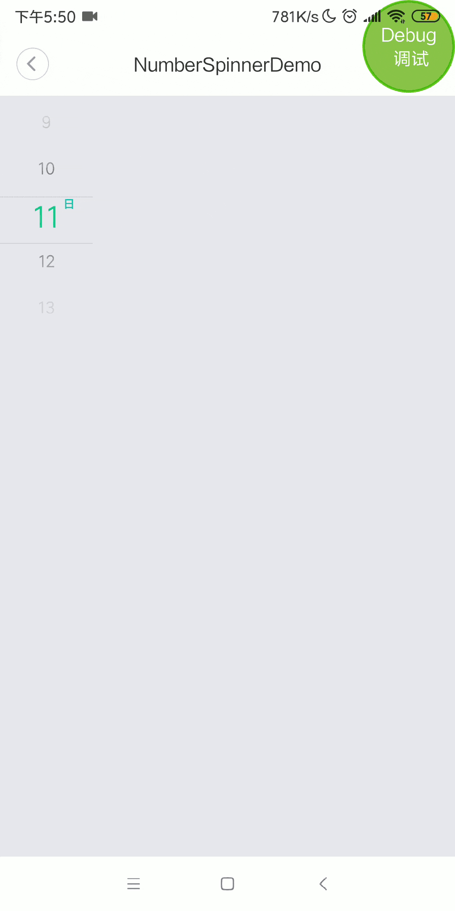

### 基本信息

| 基本信息  |                                                     |
| --------- | --------------------------------------------------- |
| 中文名称  | 数字选择器                                          |
| 描述      | 类似于iOS的滚轴，通过滚动选择具体数字（仅支持数字） |
| 位置      | `miot/ui/NumberSpinner`                             |
| SDK_Level | `SDK_10003`                                         |
| 注意事项  | \                                                   |

### 使用方法

```jsx
<NumberSpinner
  style={{width:300, height:200}}
  maxValue={30}
  minValue={-100}
  interval={2.5}
  defaultValue={80}
  valueFormat={"%.1f"}
  unit={"km"}
  onNumberChanged={data=>{
    console.log(`newValue:${data.newValue},oldValue:${data.oldValue}`);
  }}
/>
```

### 参数

| Name            | Type                | Description   |
| --------------- | ------------------- | ------------- |
| visible         | <code>bool</code>   | 是否可见      |
| unit            | <code>string</code> | 单位          |
| max             | <code>int</code>    | 最大值        |
| min             | <code>int</code>    | 最小值        |
| interval        | <code>int</code>    | 步长，默认为1 |
| defaultValue    | <code>int</code>    | 默认值        |
| valueFormat     | <code>string</code> | 格式          |
| onNumberChanged | <code>func</code>   | 值改变的回调  |

[⬆️回到目录](#目录)

***

## 通用选择器-StringSpinner

### 预览

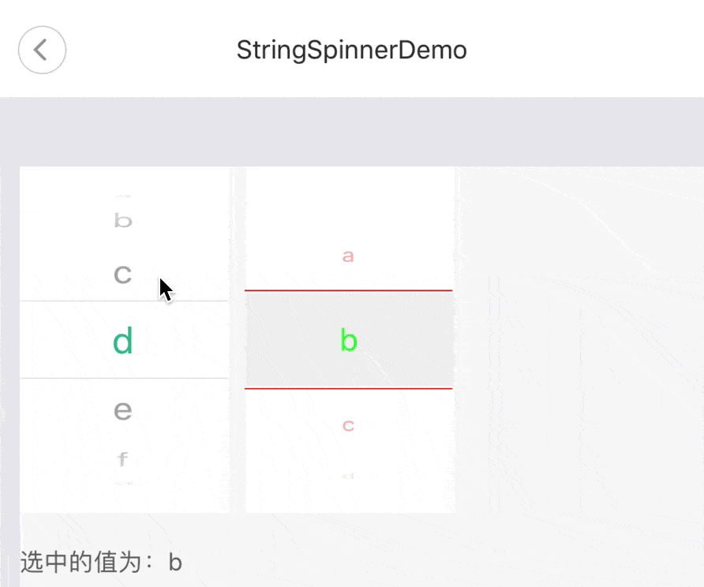

### 基本信息

| 基本信息  |                                                              |
| --------- | ------------------------------------------------------------ |
| 中文名称  | 通用选择器                                                   |
| 描述      | 类似于iOS的滚轴，通过滚动选择具体值。                        |
| 位置      | `miot/ui/StringSpinner`                                      |
| SDK_Level | `SDK_10020`                                                  |
| 详细说明  | 比`NumberSpinner`更通用，选项可以是各种字符串，并且允许自定义更多样式。 |
| 注意事项  | 在`Android`上，对于颜色属性，请尽量使用6位16进制表示，e.g. `#fff000`。不要用简称(`#000`)和别称(`red`)。 |

### 使用方法

```jsx
<StringSpinner
  style={{ 
    width: 300,
    height: 300,
    backgroundColor: '#ffffff'
  }}
  dataSource={['a', 'b', 'c', 'd']}
  defaultValue={'c'}
  pickerInnerStyle={{ 
    lineColor: "#cc0000",
    textColor: "#ff0000",
    selectTextColor: "#0000FF",
    fontSize: 12,
    selectFontSize: 30,
    rowHeight: 70,
    selectBgColor: "#f5f5f5"
  }}
  onValueChanged={(data) => { this.updateOneValue(data) }}
/>
```

### 参数

| Name                             | Type                             | Description                   |
| -------------------------------- | -------------------------------- | ----------------------------- |
| visible                          | <code>bool</code>                | 是否可见                      |
| style                            | <code>style</code>               | 开关样式，仅支持宽高          |
| dataSource                       | <code>array&lt;string&gt;</code> | 数据源                        |
| defaultValue                     | <code>string</code>              | 默认值                        |
| onValueChanged                   | <code>func</code>                | 值改变的回调                  |
| unit                             | <code>string</code>              | 单位，默认不显示单位          |
| pickerInnerStyle.textColor       | <code>string</code>              | 文字颜色 默认值 `#000000`     |
| pickerInnerStyle.selectTextColor | <code>string</code>              | 文字选中颜色 默认值 `#00aa71` |
| pickerInnerStyle.selectBgColor   | <code>string</code>              | 文字选中背景 默认值 `#ffffff` |
| pickerInnerStyle.unitTextColor   | <code>string</code>              | 单位字体颜色 默认值 `#00aa71` |
| pickerInnerStyle.lineColor       | <code>string</code>              | 分割线颜色 默认值 `#e5e5e5`   |
| pickerInnerStyle.fontSize        | <code>number</code>              | 文字大小 默认值 `22`          |
| pickerInnerStyle.selectFontSize  | <code>number</code>              | 文字选中大小 默认值 `22`      |
| pickerInnerStyle.unitFontSize    | <code>number</code>              | 单位字体大小 默认值 `12`      |
| pickerInnerStyle.rowHeight       | <code>number</code>              | 行高 默认值 `42`              |

[⬆️回到目录](#目录)

***

## 时间选择器-MHDatePicker

### 预览

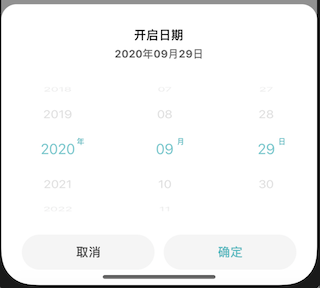

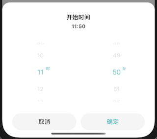

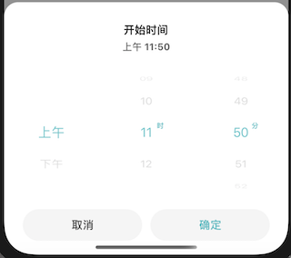

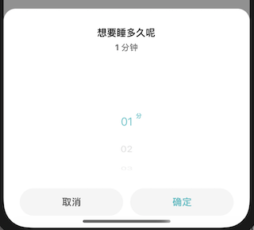

### 基本信息

| 基本信息  |                                                              |
| --------- | ------------------------------------------------------------ |
| 中文名称  | 米家时间选择器                                               |
| 描述      | 米家插件常用的时间选择器弹窗，包括*日期、时间（12/24）、单个*四种模式 |
| 位置      | `miot/ui/MHDatePicker`                                       |
| SDK_Level | `SDK_10021`                                                  |
| 注意事项  | \                                                            |

### 使用方法

```jsx
// 当时间选择器是Date 类型时，传参 current、min、max 有三种写法
// 第一种
// let current = new Date();
// current.setDate(current.getDate() - 1); // 初始值为昨天，‘去日不可追’

// let min = new Date();
// min.setFullYear(2018);
// min.setMonth(3);
// min.setDate(16); // 2018-04-16

// let max = new Date();
// max.setFullYear(current.getFullYear() + 10);
// max.setMonth(3);
// max.setDate(16); // 十年以后的-04-16

// 第二种
// let current = ['2019', '06', '03'];
// let min = ['2018', '04', '16'];
// let max = ['2029', '04', '16'];

// 第三种
let current = [2019, 6, 3];
let min = [2018, 4, 16];
let max = [2029, 4, 16];

// 基本用法
// 日期选择器
<MHDatePicker
  visible={this.state.visible}
  title='开启日期'
  type={MHDatePicker.TYPE.DATE}
  onDismiss={_ => this.onDismiss('')}
  onSelect={res => this.onSelect(res, '')}
/>
// 时间选择器（24小时制）
<MHDatePicker
  visible={this.state.visible1}
  title='开始时间'
  type={MHDatePicker.TYPE.TIME24}
  onDismiss={_ => this.onDismiss('1')}
  onSelect={res => this.onSelect(res, '1')}
/>
// 时间选择器（12小时制）
<MHDatePicker
  visible={this.state.visible2}
  title='开始时间'
  type={MHDatePicker.TYPE.TIME12}
  onDismiss={_ => this.onDismiss('2')}
  onSelect={res => this.onSelect(res, '2')}
/>
// 单个选择器
<MHDatePicker
  visible={this.state.visible3}
  title='想要睡多久呢'
  type={MHDatePicker.TYPE.SINGLE}
  singleType={MHDatePicker.SINGLE_TYPE.MINUTE}
  onDismiss={_ => this.onDismiss('3')}
  onSelect={res => this.onSelect(res, '3')}
/>
// 自定义用法
// 自定义日期选择器
<MHDatePicker
  animationType='slide'
  visible={this.state.visible4}
  title='自定义标题(自己处理多语言)，隐藏副标题'
  showSubtitle={false}
  confirmColor='#f0ac3d'
  type={MHDatePicker.TYPE.DATE}
  current={current}
  min={min}
  max={max}
  onSelect={res => this.onSelect(res, '4')}
  onDismiss={_ => this.onDismiss('4')}
/>
// 自定义单个选择器
<MHDatePicker
  animationType='slide'
  visible={this.state.visible5}
  title='自定义标题(自己处理多语言)，隐藏副标题'
  showSubtitle={false}
  confirmColor='#f0ac3d'
  type={MHDatePicker.TYPE.SINGLE}
  singleType={MHDatePicker.SINGLE_TYPE.MINUTE}
  current={['12']}
  min={['10']}
  max={['15']}
  onSelect={res => this.onSelect(res, '5')}
  onDismiss={_ => this.onDismiss('5')}
/>
```

### 参数

#### TYPE(时间选择器类型)

| Name   | Type                | Value                           | Description            |
| ------ | ------------------- | ------------------------------- | ---------------------- |
| SINGLE | <code>string</code> | <code>&quot;single&quot;</code> | 单个picker             |
| TIME24 | <code>string</code> | <code>&quot;time24&quot;</code> | 选择小时分钟，24小时制 |
| TIME12 | <code>string</code> | <code>&quot;time12&quot;</code> | 选择小时分钟，12小时制 |
| DATE   | <code>string</code> | <code>&quot;date&quot;</code>   | 选择年月日             |

#### SINGLE\_TYPE(单个picker时选择器的类型，也就是显示的单位)

| Name   | Type                | Value                           | Description |
| ------ | ------------------- | ------------------------------- | ----------- |
| MONTH  | <code>string</code> | <code>&quot;month&quot;</code>  | 月          |
| DAY    | <code>string</code> | <code>&quot;day&quot;</code>    | 日          |
| HOUR   | <code>string</code> | <code>&quot;hour&quot;</code>   | 时          |
| MINUTE | <code>string</code> | <code>&quot;minute&quot;</code> | 分          |
| SECOND | <code>string</code> | <code>&quot;second&quot;</code> | 秒          |

| Param         | Type                                                         | Description                                                  |
| ------------- | ------------------------------------------------------------ | ------------------------------------------------------------ |
| animationType | <code>string</code>                                          | modal 显示动效, 参考 https://facebook.github.io/react-native/docs/0.54/modal#animationtype |
| visible       | <code>bool</code>                                            | 是否显示 modal, 参考 https://facebook.github.io/react-native/docs/0.54/modal#visible |
| title         | <code>string</code>                                          | 标题                                                         |
| showSubtitle  | <code>bool</code>                                            | 是否显示副标题，副标题显示的内容固定，和`type`有关           |
| confirmColor  | <code>string</code>                                          | 确定按钮的颜色，默认米家绿                                   |
| type          | [<code>TYPE</code>](#type时间选择器类型)                                   | 时间选择器类型                                               |
| singleType    | [<code>SINGLE\_TYPE</code>](#single_type单个picker时选择器的类型也就是显示的单位)                    | 单个picker时的选择器类型                                     |
| current       | <code>array&lt;string&gt;</code> \| <code>arraynumber&gt;</code> \| <code>Date</code> | 当前选中值，可传入数字数组，字符串数组，Date实例，对所有时间选择器类型有效 |
| min           | <code>array&lt;string&gt;</code> \| <code>array&lt;number&gt;</code> \| <code>Date</code> | 最小值，可传入数字数组，字符串数组，Date实例，只对`'single'`和`'date'`类型生效 |
| max           | <code>array&lt;string&gt;</code> \| <code>array&lt;number&gt;</code> \| <code>Date</code> | 最大值，可传入数字数组，字符串数组，Date实例，只对`'single'`和`'date'`类型生效 |
| onSelect      | <code>function</code>                                        | 选好之后的回调函数，返回所有picker的选中值 组成的数组 / 拼接的字符串 / 以及计算出的Date实例, 详见官方 Demo（com.xiaomi.demo->UI能力->时间选择器） |
| onDismiss     | <code>function</code>                                        | 点击`Modal`内容外面/取消按钮/确定按钮，Modal隐藏时的回调函数 |

[⬆️回到目录](#目录)

***

## 米家弹窗-通用弹窗容器-AbstractDialog

### 背景

SDK在开放之初就内置了一些Dialog，比如：`InputDialog`、`MessageDialog`和`LoadingDialog`等。但这些弹窗都是由原生组件导出，不易维护和修改，且存在着一些问题：

- [Loading Dialog样式Android和iOS的不一致 #938](https://github.com/MiEcosystem/miot-plugin-sdk/issues/938)
- [米家Dialog类组件文字颜色是否可以提供自定义 #921](https://github.com/MiEcosystem/miot-plugin-sdk/issues/921)
- [InputDialog 控件在 iOS 端调用不起来，在 android 可以 #908](https://github.com/MiEcosystem/miot-plugin-sdk/issues/908)
- [新Dialog需求 #877](https://github.com/MiEcosystem/miot-plugin-sdk/issues/877)
- [各种 Dialog 的各种问题 #719](https://github.com/MiEcosystem/miot-plugin-sdk/issues/719)
- [Loading Dialog 在iOS上无法手动取消 #554](https://github.com/MiEcosystem/miot-plugin-sdk/issues/554)
- [SingleChoiceDialog更新Check属性后无法更新选中项目（iOS表现正常） #454](https://github.com/MiEcosystem/miot-plugin-sdk/issues/454)
- [MessageDialog 为什么只显示一次？ #222](https://github.com/MiEcosystem/miot-plugin-sdk/issues/222)
- [MessageDialog 问题 #214](https://github.com/MiEcosystem/miot-plugin-sdk/issues/214)
- [LoadingDialog 相关 #123](https://github.com/MiEcosystem/miot-plugin-sdk/issues/123)
- [miot/ui Dialog 相关组件疑问 #110](https://github.com/MiEcosystem/miot-plugin-sdk/issues/110)

这些问题的解决依赖于两个平台的APP发版，十分不灵活，因此我们用纯JS实现了一组弹窗，并抽象出通用的弹窗容器，允许开发者在满足设计规范的同时自定义弹窗内容。以下所有的弹窗都是基于`AbstractDialog`实现，如果开发者在实现自定义弹窗的时候有任何问题，可以阅读源码参考。

### 预览

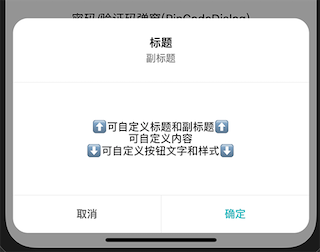

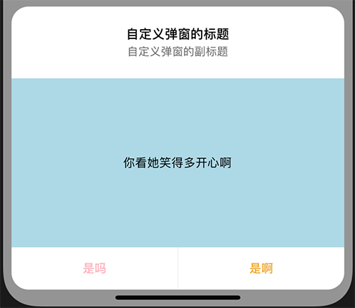

### 基本信息

| 基本信息  |                                                              |
| --------- | ------------------------------------------------------------ |
| 中文名称  | 米家插件通用弹窗容器                                         |
| 描述      | 符合米家插件设计规范的通用弹窗容器，除顶部标题和底部按钮外，可自定义弹窗内容 |
| 位置      | `miot/ui/Dialog/AbstractDialog`                              |
| SDK_Level | `SDK_10022`                                                  |
| 注意事项  | \                                                            |

### 使用方法

```jsx
<AbstractDialog
  visible={this.state.visible0}
  title={testTitle}
  subtitle={testTitle}
  showSubtitle
  onDismiss={_ => this.onDismiss('0')}
/>

// 自定义内容
<AbstractDialog
  visible={this.state.visible1}
  title={testTitle}
  subtitle={testTitle}
  showSubtitle
  onDismiss={_ => this.onDismiss('1')}
  buttons={[
    {
      text: '是吗',
      style: { color: 'lightpink' },
      callback: _ => console.log('是吗')
    },
    {
      text: '是啊',
      style: { color: '#f0ac3d' },
      callback: _ => console.log('是啊')
    }
  ]}
>
  <View
    style={{
      flex: 1,
      height: 200,
      backgroundColor: 'lightblue',
      alignItems: 'center',
      justifyContent: 'center'
    }}
    >
    <Text>你看她笑得多开心啊</Text>
  </View>
</AbstractDialog>
```

### 参数

#### Button(按钮)

| Name     | Type                  | Description        |
| -------- | --------------------- | ------------------ |
| text     | <code>string</code>   | 按钮的文字         |
| style    | <code>style</code>    | 按钮的样式         |
| callback | <code>function</code> | 点击按钮的回调函数 |

| Param         | Type                                            | Description                                                  |
| ------------- | ----------------------------------------------- | ------------------------------------------------------------ |
| animationType | <code>string</code>                             | modal 显示动效, 默认`'fade'`，参考 https://facebook.github.io/react-native/docs/0.54/modal#animationtype |
| visible       | <code>bool</code>                               | 是否显示 modal, 默认`false`，参考 https://facebook.github.io/react-native/docs/0.54/modal#visible |
| style         | <code>style</code>                              | modal 的自定义样式                                           |
| title         | <code>string</code>                             | 标题                                                         |
| subtitle      | <code>string</code>                             | 副标题                                                       |
| showTitle     | <code>bool</code>                               | 是否显示标题，如果`false`，整个标题都不显示（包括副标题），默认`true` |
| showSubtitle  | <code>bool</code>                               | 是否显示副标题，默认`false`                                  |
| canDismiss    | <code>bool</code>                               | 是否允许点击蒙层背景隐藏 Modal，默认`true`                   |
| buttons       | [<code>Array&lt;Button&gt;</code>](#button按钮) | 按钮数组，定义底部按钮的属性，只能显示1～2个按钮，多传将失效。默认左取消右确定，左灰右绿，点击回调都是隐藏 Modal |
| showButton    | <code>bool</code>                               | 是否显示按钮，默认`true`                                     |
| onDismiss     | <code>function</code>                           | 点击`Modal`内容外面/取消按钮/确定按钮，Modal隐藏时的回调函数 |

[⬆️回到目录](#目录)

***

## 米家弹窗-加载弹窗-LoadingDialog

### 预览

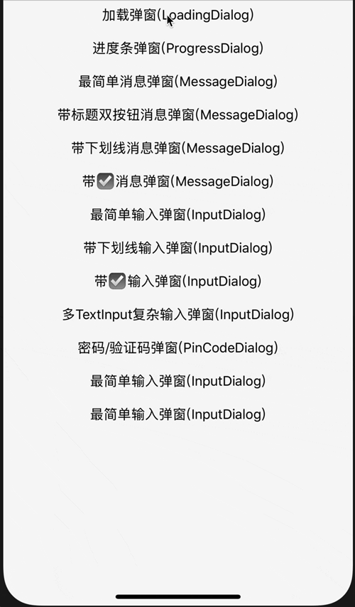

### 基本信息

| 基本信息  |                                                              |
| --------- | ------------------------------------------------------------ |
| 中文名称  | 加载弹窗                                                     |
| 描述      | 通过加载动画和文案提示用户需要等待，点击背景不会隐藏，可通过改变`visible` 属性隐藏，也可以设置超时时间 |
| 位置      | `miot/ui/Dialog/LoadingDialog`                               |
| SDK_Level | `SDK_10022`                                                  |
| 注意事项  | \                                                            |

### 使用方法

```jsx
<LoadingDialog
  visible={this.state.visible2}
  message='加载中，请稍后...'
  timeout={3000}
  onDismiss={_ => this.onDismiss('2')}
/>
```

### 参数

| Param         | Type                  | Description                                                  |
| ------------- | --------------------- | ------------------------------------------------------------ |
| animationType | <code>string</code>   | modal 显示动效, 默认`'fade'`，参考 https://facebook.github.io/react-native/docs/0.54/modal#animationtype |
| visible       | <code>bool</code>     | 是否显示 modal, 默认`false`，参考 https://facebook.github.io/react-native/docs/0.54/modal#visible |
| message       | <code>string</code>   | 显示文字                                                     |
| timeout       | <code>number</code>   | Modal 隐藏的超时时间(ms)，如果不主动设置隐藏的话             |
| onDismiss     | <code>function</code> | Modal隐藏时的回调函数                                        |

[⬆️回到目录](#目录)

***

## 米家弹窗-进度弹窗-ProgressDialog

### 预览

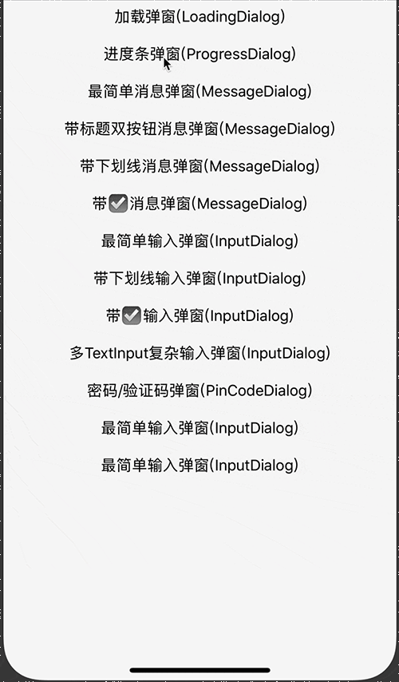

### 基本信息

| 基本信息  |                                                              |
| --------- | ------------------------------------------------------------ |
| 中文名称  | 进度弹窗                                                     |
| 描述      | 在需要用户长时间等待的时候，告知用户当前进度，比如最常用场景：下载。点击背景不会隐藏，可通过改变`visible` 属性隐藏，也可以设置`autoDismiss`在进度完成后自动隐藏 |
| 位置      | `miot/ui/Dialog/ProgressDialog`                              |
| SDK_Level | `SDK_10022`                                                  |
| 注意事项  | \                                                            |

### 使用方法

```jsx
<ProgressDialog
  autoDismiss
  visible={this.state.visible3}
  message='下载中，请稍后...'
  color='#f0ac3d'
  unfilledColor='#fff'
  textColor='blue'
  progress={this.state.progress}
  onDismiss={_ => this.onDismiss('3')}
/>
```

### 参数

| Param         | Type                  | Description                                                  |
| ------------- | --------------------- | ------------------------------------------------------------ |
| animationType | <code>string</code>   | modal 显示动效, 默认`'fade'`，参考 https://facebook.github.io/react-native/docs/0.54/modal#animationtype |
| visible       | <code>bool</code>     | 是否显示 modal, 默认`false`，参考 https://facebook.github.io/react-native/docs/0.54/modal#visible |
| message       | <code>string</code>   | 提示信息文字                                                 |
| progress      | <code>number</code>   | 当前进度，默认`0`，范围为 `0～1`                             |
| color         | <code>string</code>   | progressBar 填充颜色，默认米家绿                             |
| unfilledColor | <code>string</code>   | progressBar 未填充颜色，默认`#f1f1f1`                        |
| textColor     | <code>string</code>   | 进度百分比文字颜色，默认米家绿                               |
| autoDismiss   | <code>bool</code>     | 是否在进度条读完之后自动隐藏 Modal, 默认`false`              |
| onDismiss     | <code>function</code> | Modal 隐藏时的回调函数                                       |

[⬆️回到目录](#目录)

***

## 米家弹窗-消息弹窗-MessageDialog

### 预览

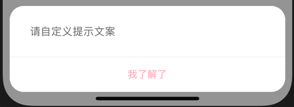

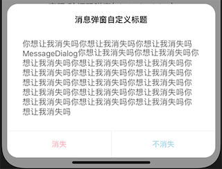

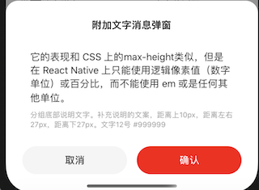

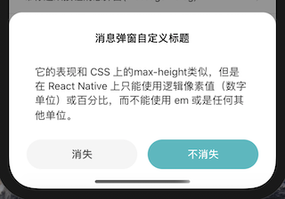

### 基本信息

| 基本信息  |                                                              |
| --------- | ------------------------------------------------------------ |
| 中文名称  | 消息弹窗                                                     |
| 描述      | 弹出一段消息文字提示用户。允许多行文案，但请尽量精简，组件最多显示**15**行。同时允许其他交互，比如勾选和下划线点击 |
| 位置      | `miot/ui/Dialog/MessageDialog`                               |
| SDK_Level | `SDK_10022`                                                  |
| 注意事项  | \                                                            |

### 使用方法

```jsx
// 无标题
<MessageDialog
  visible={this.state.visible4}
  buttons={[
    {
      text: '我了解了',
      style: { color: 'lightpink' },
      callback: _ => this.setState({ visible4: false })
    },
  ]}
  onDismiss={_ => this.onDismiss('4')}
/>
// 有标题
<MessageDialog
  visible={this.state.visible5}
  title='消息弹窗自定义标题'
  message={testText}
  buttons={[
    {
      text: '消失',
      style: { color: 'lightpink' },
      callback: _ => this.setState({ visible5: false })
    },
    {
      text: '不消失',
      style: { color: 'lightblue' },
      callback: _ => console.log('不消失')
    },
  ]}
  onDismiss={_ => this.onDismiss('5')}
/>
// 带下划线
<MessageDialog
  type={MessageDialog.TYPE.UNDERLINE}
  visible={this.state.visible6}
  color='#f0ac3d'
  title='下划线消息弹窗'
  message={testText}
  extraText='你点我一下试试'
  extra={{
    onPress: _ => alert('点击了下划线')
  }}
  buttons={[
    {
      text: '取消',
      style: { color: 'lightpink' },
      callback: _ => this.setState({ visible6: false })
    },
    {
      text: '确认',
      style: { color: 'lightblue' },
      callback: obj => {
        console.log(`是否点击了下划线: ${obj.hasPressUnderlineText}`);
        this.setState({ visible6: false })
      }
    },
  ]}
  onDismiss={_ => this.onDismiss('6')}
/>
// 带勾选框
<MessageDialog
  type={MessageDialog.TYPE.CHECKBOX}
  visible={this.state.visible7}
  color='#f0ac3d'
  title='勾选框消息弹窗'
  message={testText}
  extraText='快点我试试'
  extra={this.state.extra}
  buttons={[
    {
      text: '取消',
      style: { color: 'lightpink' },
      callback: _ => this.setState({ visible7: false })
    },
    {
      text: '确认',
      style: { color: 'lightblue' },
      callback: obj => {
        console.log(`是否勾选: ${obj.checked}`);
        this.setState({ visible7: false })
      }
    },
  ]}
  onDismiss={_ => this.onDismiss('7')}
/>
```

### 参数

#### TYPE(消息弹窗的类型)

| Name      | Type                | Default                            | Description        |
| --------- | ------------------- | ---------------------------------- | ------------------ |
| SIMPLE    | <code>string</code> | <code>&quot;simple&quot;</code>    | 普通，只有提示文字 |
| UNDERLINE | <code>string</code> | <code>&quot;underline&quot;</code> | 带下划线超链接     |
| CHECKBOX  | <code>string</code> | <code>&quot;checkbox&quot;</code>  | 带勾选框           |

#### Extra(下划线超链接或者勾选框需要的其他数据)
| Name    | Type                  | Description                                        |
| ------- | --------------------- | -------------------------------------------------- |
| checked | <code>boolean</code>  | 勾选框的初始勾选状态，只对`TYPE.CHECKBOX`有效      |
| onPress | <code>function</code> | 点击下划线链接的回调函数，只对`TYPE.UNDERLINE`有效 |

| Param         | Type                                                         | Description                                                  |
| ------------- | ------------------------------------------------------------ | ------------------------------------------------------------ |
| animationType | <code>string</code>                                          | modal 显示动效, 默认`'fade'`，参考 https://facebook.github.io/react-native/docs/0.54/modal#animationtype |
| visible       | <code>bool</code>                                            | 是否显示 modal, 默认`false`，参考 https://facebook.github.io/react-native/docs/0.54/modal#visible |
| type          | [<code>TYPE</code>](#type消息弹窗的类型)                     | 消息弹窗的类型。是否只有提示文字，是否有下划线超链接，或者是否有勾选项，详见 `TYPE`，默认 `TYPE.SIMPLE` |
| color         | <code>string</code>                                          | 下划线超链接的文字颜色 / 勾选框的勾选颜色，默认米家绿        |
| title         | <code>string</code>                                          | 标题文字，不传或者为空字符串将不显示标题栏，默认不显示       |
| message       | <code>string</code>                                          | 提示信息文字，可显示单行或者多行，最多**15**行               |
| extraText     | <code>string</code>                                          | 下划线超链接的文字 / 勾选框右侧的说明文字                    |
| extra         | [<code>Extra</code>](#extra下划线超链接或者勾选框需要的其他数据) | 下划线超链接或者勾选框需要的其他数据，只对`TYPE.UNDERLINE`和`TYPE.CHECKBOX`有效 |
| buttons       | [<code>Array&lt;Button&gt;</code>](#button按钮)              | 和`AbstractDialog`的`buttons`属性相同                        |
| onDismiss     | <code>function</code>                                        | Modal 隐藏时的回调函数                                       |

[⬆️回到目录](#目录)

***

## 米家弹窗-输入弹窗-InputDialog

### 预览

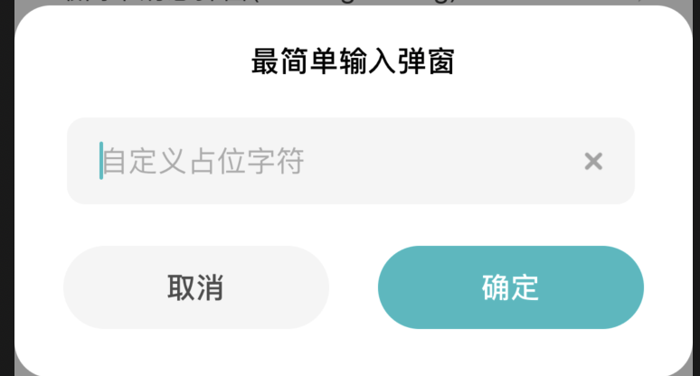

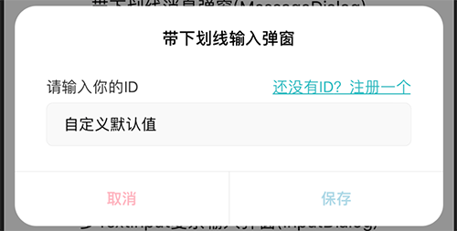

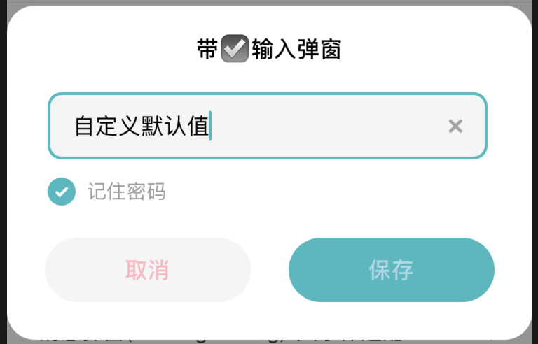

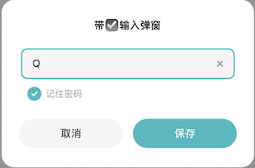

### 基本信息

| 基本信息  |                                                              |
| --------- | ------------------------------------------------------------ |
| 中文名称  | 输入弹窗                                                     |
| 描述      | 提示用户录入信息并记录。输入框弹窗的业务场景有时候会很复杂，如果本组件无法满足你的业务需求，请使用 `AbstractDialog` 参考本组件源码自行实现 |
| 位置      | `miot/ui/Dialog/InputDialog`                                 |
| SDK_Level | `SDK_10022`                                                  |
| 注意事项  | `TextInput` 的 `onEndEditing`不能使用                        |

### 使用方法

```jsx
<InputDialog
  visible={this.state.visible8}
  title='最简单输入弹窗'
  onDismiss={_ => this.onDismiss('8')}
/>
<InputDialog
  type={InputDialog.TYPE.UNDERLINE}
  visible={this.state.visible9}
  title='带下划线输入弹窗'
  underlineData={{
    leftText: '请输入你的ID',
    underlineText: '还没有ID？注册一个',
    onPress: _ => alert('你注册的ID是123456')
  }}
  buttons={[
    {
      text: '取消',
      style: { color: 'lightpink' },
      callback: _ => this.setState({ visible9: false })
    },
    {
      text: '保存',
      style: { color: 'lightblue' },
      callback: result => {
        console.log(`结果`, result);
        this.setState({ visible9: false });
      }
    },
  ]}
  onDismiss={_ => this.onDismiss('9')}
/>
<InputDialog
  type={InputDialog.TYPE.CHECKBOX}
  visible={this.state.visible10}
  title='带☑️输入弹窗'
  checkboxData={{
    checked: true,
      text: '记住密码'
  }}
  buttons={[
    {
      text: '取消',
      style: { color: 'lightpink' },
      callback: _ => this.setState({ visible10: false })
    },
    {
      text: '保存',
      style: { color: 'lightblue' },
      callback: result => {
        console.log(`结果`, result);
        this.setState({ visible10: false });
      }
    },
  ]}
  onDismiss={_ => this.onDismiss('10')}
/>
<InputDialog
  visible={this.state.visible11}
  type={InputDialog.TYPE.BOTH}
  color='#f0ac3d'
  title='多TextInput复杂输入弹窗'
  underlineData={{
    leftText: '请输入你的ID',
    underlineText: '还没有ID？注册一个',
    onPress: _ => alert('你注册的ID是123456')
  }}
  inputs={this.state.inputs}
  checkboxData={this.state.checkboxData}
  buttons={[
    {
      text: '取消',
      style: { color: 'lightpink' },
      callback: _ => this.setState({ visible11: false })
    },
    {
      text: '保存',
      style: { color: 'lightblue' },
      callback: result => {
        console.log(`结果`, result);
        this.setState({ visible11: false });
      }
    },
  ]}
  onDismiss={_ => this.onDismiss('11')}
/>
```

### 参数

#### TYPE(输入弹窗的类型)

| Name      | Type                | Default                            | Description                                                 |
| --------- | ------------------- | ---------------------------------- | ----------------------------------------------------------- |
| SIMPLE    | <code>string</code> | <code>&quot;simple&quot;</code>    | 普通，只有输入框                                            |
| UNDERLINE | <code>string</code> | <code>&quot;underline&quot;</code> | 输入框上方有文字说明和下划线超链接                          |
| CHECKBOX  | <code>string</code> | <code>&quot;checkbox&quot;</code>  | 输入框下方有勾选框和文字                                    |
| BOTH      | <code>string</code> | <code>&quot;both&quot;</code>      | 输入框上方有文字说明和下划线超链接 输入框下方有勾选框和文字 |

#### UnderlineData(输入框上方下划线数据)

| Name          | Type                  | Description              |
| ------------- | --------------------- | ------------------------ |
| leftText      | <code>string</code>   | 左侧说明文字             |
| underlineText | <code>string</code>   | 右侧下划线文字           |
| onPress       | <code>function</code> | 点击下划线文字的回调函数 |

#### Input(输入框)

| Name           | Type                  | Description                                                  |
| -------------- | --------------------- | ------------------------------------------------------------ |
| placeholder    | <code>string</code>   | 占位文字，参考 https://facebook.github.io/react-native/docs/0.54/textinput#placeholder |
| defaultValue   | <code>string</code>   | 初始默认文字，参考 https://facebook.github.io/react-native/docs/0.54/textinput#defaultvalue |
| onChangeText   | <code>function</code> | 文字变化回调，参考 https://facebook.github.io/react-native/docs/0.54/textinput#onchangetext |
| textInputProps | <code>Object</code>   | 其他 TextInput 支持的属性，参考 https://facebook.github.io/react-native/docs/0.54/textinput#props |

#### CheckboxData(输入框下方勾选框数据)

| Name    | Type                 | Description          |
| ------- | -------------------- | -------------------- |
| checked | <code>boolean</code> | 勾选框的初始勾选状态 |
| text    | <code>string</code>  | 勾选框右侧的说明文字 |

| Param         | Type                                                         | Description                                                  |
| ------------- | ------------------------------------------------------------ | ------------------------------------------------------------ |
| animationType | <code>string</code>                                          | modal 显示动效, 默认`'fade'`，参考 https://facebook.github.io/react-native/docs/0.54/modal#animationtype |
| visible       | <code>bool</code>                                            | 是否显示 modal, 默认`false`，参考 https://facebook.github.io/react-native/docs/0.54/modal#visible |
| type          | [<code>TYPE</code>](#TYPE输入弹窗的类型)                     | 输入弹窗的类型。是否只有输入框，输入框上方是否有下划线超链接，输入框下方是否有勾选项，详见 `TYPE`，默认 `TYPE.SIMPLE` |
| color         | <code>string</code>                                          | 下划线超链接的文字颜色 / 勾选框的勾选颜色，默认米家绿        |
| title         | <code>string</code>                                          | 标题文字                                                     |
| underlineData | [<code>UnderlineData</code>](#UnderlineData输入框上方下划线数据) | 输入框上方的数据，包括左侧说明文字，右侧下划线文字及其点击回调函数，只对 `TYPE.UNDERLINE` 和 `TYPE.BOTH` 有效 |
| inputs        | [<code>Array&lt;Input&gt;</code>](#Input输入框)              | 输入框数组，定义输入框的属性，对所有的 `TYPE` 有效           |
| checkboxData  | [<code>CheckboxData</code>](#CheckboxData输入框下方勾选框数据) | 输入框下方的数据，包括勾选状态，描述文字，只对 `TYPE.CHECKBOX` 和 `TYPE.BOTH` 有效 |
| buttons       | [<code>Array&lt;Button&gt;</code>](#button按钮)              | 和`AbstractDialog`的`buttons`属性相同                        |
| onDismiss     | <code>function</code>                                        | Modal 隐藏时的回调函数                                       |

[⬆️回到目录](#目录)

***

## 米家弹窗-密码弹窗-PinCodeDialog

### 预览

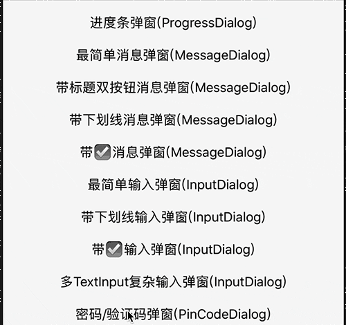

### 基本信息

| 基本信息  |                                                              |
| --------- | ------------------------------------------------------------ |
| 中文名称  | 密码弹窗                                                     |
| 描述      | 用于输入密码或者验证码，允许输入**3～6位**                      |
| 位置      | `miot/ui/Dialog/PinCodeDialog`                                 |
| SDK_Level | `SDK_10022`                                                  |
| 注意事项  |                                                           |

### 使用方法

```jsx
<PinCodeDialog
  visible={this.state.visible12}
  title='密码/验证码弹窗'
  message={testText}
  digit={6}
  color='#f0ac3d'
  checkboxData={this.state.checkboxData}
  buttons={[
    {
      text: '确定',
      style: { color: 'lightblue' },
      callback: result => {
        console.log(`结果`, result);
        this.setState({ visible12: false });
      }
    },
  ]}
  onDismiss={_ => this.onDismiss('12')}
/>
```

### 参数

#### CheckboxData(勾选框相关数据)

| Name | Type | Description |
| --- | --- | --- |
| checked | <code>boolean</code> | 勾选框的初始勾选状态 |
| text | <code>string</code> | 勾选框右侧的说明文字 |

| Param         | Type                                                     | Description                                                  |
| ------------- | -------------------------------------------------------- | ------------------------------------------------------------ |
| animationType | <code>string</code>                                      | modal 显示动效, 默认`'fade'`，参考 https://facebook.github.io/react-native/docs/0.54/modal#animationtype |
| visible       | <code>bool</code>                                        | 是否显示 modal, 默认`false`，参考 https://facebook.github.io/react-native/docs/0.54/modal#visible |
| title         | <code>string</code>                                      | 标题文字                                                     |
| message       | <code>string</code>                                      | 文字说明                                                     |
| digit         | <code>number</code>                                      | 输入框数量，允许3～6个，默认是6个                            |
| color         | <code>string</code>                                      | 勾选框的勾选颜色 / 输入框focus时的边框颜色，默认米家绿       |
| checkboxData  | [<code>CheckboxData</code>](#CheckboxData勾选框相关数据) | 输入框下方的勾选状态和描述文字，如果不传将不显示             |
| buttons       | [<code>Array&lt;Button&gt;</code>](#button按钮)          | 和`AbstractDialog`的`buttons`属性相同                        |
| onDismiss     | <code>function</code>                                    | Modal 隐藏时的回调函数                                       |

[⬆️回到目录](#目录)

***

## 米家弹窗-分享弹窗-ShareDialog

### 预览

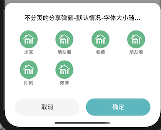

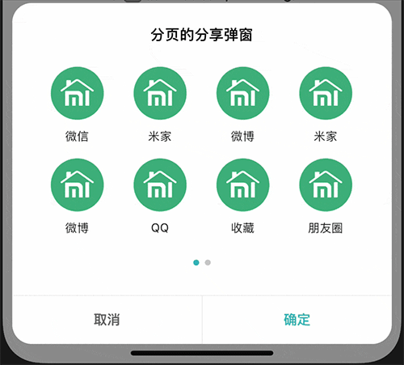

### 基本信息

| 基本信息  |                                                              |
| --------- | ------------------------------------------------------------ |
| 中文名称  | 分享弹窗                                                     |
| 描述      | 弹窗提示，让用户选择分享到指定平台                             |
| 位置      | `miot/ui/Dialog/ShareDialog`                                 |
| SDK_Level | `SDK_10022`                                                  |
| 注意事项  | `Android`下`Swiper`和`Modal`显示有冲突，所以需要`Modal`先显示，`Swiper`后显示。表现为弹窗先显示后，图标才开始刷新显示，属于正常现象 |

### 使用方法

```jsx
<ShareDialog
  visible={this.state.visible13}
  title='不分页的分享弹窗'
  onDismiss={_ => this.onDismiss('13')}
/>
<ShareDialog
  visible={this.state.visible14}
  title='分页的分享弹窗'
  options={
    Array.from({ length: 15 }, (v, i) => ({
      icon: testIcon,
      text: [`米家`, `微信`, `QQ`, `微博`, `朋友圈`, `收藏`, `即刻`][~~(Math.random() * 7)],
      callback: () => console.log('分享成功')
    }))
  }
  onDismiss={_ => this.onDismiss('14')}
/>
```

### 参数

#### Opiton(分享选项)

| Name | Type | Description |
| --- | --- | --- |
| icon | <code>number</code> | 图标的资源, `require('../xx/xx.png’)` |
| text | <code>string</code> | 图标下方的文字说明 |
| callback | <code>function</code> | 点击图标的回调函数 |

| Param | Type | Description |
| --- | --- | --- |
| animationType | <code>string</code> | modal 显示动效, 默认`'fade'`，参考 https://facebook.github.io/react-native/docs/0.54/modal#animationtype |
| visible | <code>bool</code> | 是否显示 modal, 默认`false`，参考 https://facebook.github.io/react-native/docs/0.54/modal#visible |
| title | <code>string</code> | 标题文字 |
| options | [<code>Array&lt;Opiton&gt;</code>](#Opiton分享选项) | 分享选项，一页最多显示**8个**，当可选项**>8个**时，允许左右滑动分页 |
| buttons | [<code>Array&lt;Button&gt;</code>](#button按钮)    | 和`AbstractDialog`的`buttons`属性相同    |
| onDismiss | <code>function</code> | Modal 隐藏时的回调函数 |

[⬆️回到目录](#目录)

***

## 米家弹窗-操作列表-ActionSheet

### 预览

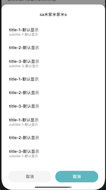

### 基本信息

| 基本信息  |                                                              |
| --------- | ------------------------------------------------------------ |
| 中文名称  | 操作列表                                                     |
| 描述      | 弹窗提示，让用户选择不同的操作，和iOS原生的[ActionSheet](https://facebook.github.io/react-native/docs/0.54/actionsheetios#docsNav)相似 |
| 位置      | `miot/ui/Dialog/ActionSheet`                                 |
| SDK_Level | `SDK_10022`                                                  |
| 注意事项  |  |

### 使用方法

```jsx
<ActionSheet
  visible={this.state.visible15}
  options={[
    {
      title: '🙈',
      subtitle: '🙈',
      onPress: _ => console.log('非礼勿视')
    },
    {
      title: '🙉',
      onPress: _ => console.log('非礼勿听')
    },
    {
      title: '🙊',
      subtitle: '🙊',
      onPress: _ => console.log('非礼勿言')
    }
  ]}
  buttons={[
    {
      text: '取消',
      style: { color: 'lightblue' },
      callback: _ => this.setState({ visible15: false })
    }
  ]}
  onDismiss={_ => this.onDismiss('15')}
/>
```

### 参数

#### Opiton(可点击的选项)

| Name | Type | Description |
| --- | --- | --- |
| title | <code>string</code> | 主文案 |
| subtitle | <code>string</code> | 副文案 |
| onPress | <code>function</code> | 点击回调函数 |

| Param | Type | Description |
| --- | --- | --- |
| animationType | <code>string</code> | modal 显示动效, 默认`'fade'`，参考 https://facebook.github.io/react-native/docs/0.54/modal#animationtype |
| visible | <code>bool</code> | 是否显示 modal, 默认`false`，参考 https://facebook.github.io/react-native/docs/0.54/modal#visible |
| options | [<code>Array&lt;Opiton&gt;</code>](#Opiton可点击的选项) | 可点击的选项 |
| buttons | [<code>Array&lt;Button&gt;</code>](#button按钮)        | 和`AbstractDialog`的`buttons`属性相同 |
| onDismiss | <code>function</code> | Modal 隐藏时的回调函数 |

[⬆️回到目录](#目录)

***

## 米家弹窗-选择弹窗-ChoiceDialog

### 预览

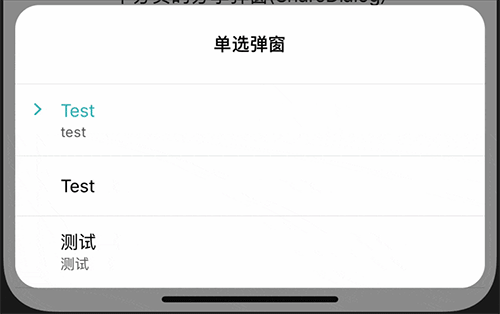

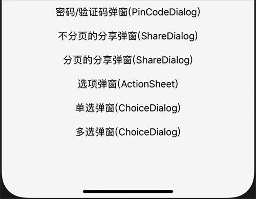

### 基本信息

| 基本信息  |                                                              |
| --------- | ------------------------------------------------------------ |
| 中文名称  | 选择弹窗                                                     |
| 描述      | 弹窗让用户从不同选项中选择一项或者多项 |
| 位置      | `miot/ui/Dialog/ChoiceDialog`                                 |
| SDK_Level | `SDK_10022`                                                  |
| 注意事项  |  |

### 使用方法

```jsx
<ChoiceDialog
  visible={this.state.visible16}
  title={'单选弹窗'}
  options={[
    {
      title: 'Test',
      subtitle: 'test',
    },
    {
      title: 'Test',
    },
    {
      title: '测试',
      subtitle: '测试',
    }
  ]}
  selectedIndexArray={this.state.selectedIndexArray}
  onDismiss={_ => this.onDismiss('16')}
  onSelect={result => this.state.selectedIndexArray = result}
/>
<ChoiceDialog
  type={ChoiceDialog.TYPE.MULTIPLE}
  visible={this.state.visible17}
  title={'多选弹窗'}
  options={[
    {
      title: '🙈',
      subtitle: '🙈',
    },
    {
      title: '🙉',
      subtitle: '🙉',
    },
    {
      title: '🙊',
      subtitle: '🙊',
    }
  ]}
  selectedIndexArray={this.state.selectedIndexArray1}
  color="#f0ac3d"
  buttons={[
    {
      text: '保存',
      style: { color: 'lightblue' },
      callback: result => {
        console.log(`选中的选项`, result);
        this.setState({
          visible17: false,
          selectedIndexArray1: result
        });
      }
    }
  ]}
  onDismiss={_ => this.onDismiss('17')}
/>
```

### 参数

#### TYPE(选择弹窗的类型)

| Name | Type | Default | Description |
| --- | --- | --- | --- |
| SINGLE | <code>string</code> | <code>&quot;single&quot;</code> | 单选弹窗，将不显示底部按钮，选择某项之后弹窗消失 |
| MULTIPLE | <code>string</code> | <code>&quot;multiple&quot;</code> | 多选弹窗 |

#### Opiton(可选项)

| Name | Type | Description |
| --- | --- | --- |
| title | <code>string</code> | 主文案 |
| subtitle | <code>string</code> | 副文案 |

| Param              | Type                                              | Description                                                  |
| ------------------ | ------------------------------------------------- | ------------------------------------------------------------ |
| animationType      | <code>string</code>                               | modal 显示动效, 默认`'fade'`，参考 https://facebook.github.io/react-native/docs/0.54/modal#animationtype |
| visible            | <code>bool</code>                                 | 是否显示 modal, 默认`false`，参考 https://facebook.github.io/react-native/docs/0.54/modal#visible |
| type               | [<code>TYPE</code>](#TYPE选择弹窗的类型)          | 选择弹窗类型，定义是单选弹窗还是多选弹窗，默认是单选弹窗     |
| title              | <code>string</code>                               | 标题                                                         |
| options            | [<code>Array&lt;Opiton&gt;</code>](#Opiton可选项) | 可选项                                                       |
| selectedIndexArray | <code>Array&lt;number&gt;</code>                  | 选中选项的下标，默认全部未选中                               |
| color              | <code>string</code>                               | 选中态颜色，单选时表示选中文字颜色，多选时表示勾选框勾选背景颜色，默认米家绿 |
| icon               | <code>number</code>                               | 选项被选中时的选中图标，放在文字前面，`TYPE.SINGLE`可用，默认绿色右箭头图片 |
| buttons            | [<code>Array&lt;Button&gt;</code>](#button按钮)   | 和`AbstractDialog`的`buttons`属性相同                        |
| onSelect           | <code>function</code>                             | 选项选择后的确认回调，返回选中选项的下标数组，`TYPE.SINGLE`可用 |
| onDismiss          | <code>function</code>                             | Modal 隐藏时的回调函数                                       |

[⬆️回到目录](#目录)

***

## 空白页面-BlankPage

### 预览

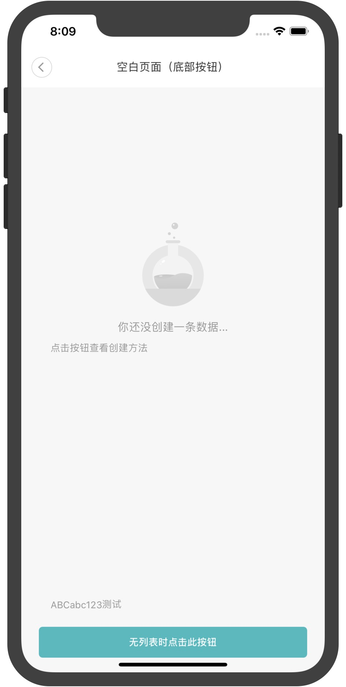

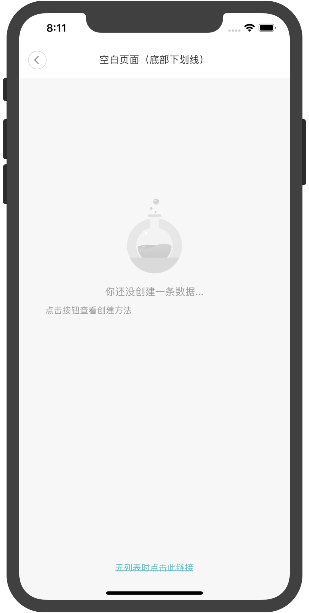

### 基本信息

| 基本信息  |                      |
| --------- | -------------------- |
| 中文名称  | 空白页面                 |
| 描述      | 就是一个普通的空白页面，在数据未加载完毕或者加载失败的时候显示 |
| 位置      | `miot/ui/BlankPage`     |
| SDK_Level | `SDK_10024`          |
| 注意事项  | \                    |

### 使用方法

```jsx
const props1 = {
  // type: BlankPage.TYPE.BUTTON, // 默认是按钮
  button: {
    text: '无列表时点击此按钮',
    callback: _ => alert('点击按钮')
  }
  message: '你还没创建一条数据...',
  desc: '点击按钮查看创建方法',
  extraInfo: 'ABCabc123测试'
}
const props2 = {
  type: BlankPage.TYPE.UNDERLINE,
  underline: {
    text: '无列表时点击此链接',
    callback: _ => alert('点击超链接')
  }
  message: '你还没创建一条数据...',
  desc: '点击按钮查看创建方法',
  extraInfo: 'ABCabc123测试'
}
...
<BlankPage {...props1} />
<BlankPage {...props2} />
```

### 参数

#### TYPE(空白页面底部视图类型)

| Name      | Type                | Value                              | Description        |
| --------- | ------------------- | ---------------------------------- | ------------------ |
| BUTTON    | <code>string</code> | <code>&quot;button&quot;</code>    | 底部是按钮         |
| UNDERLINE | <code>string</code> | <code>&quot;underline&quot;</code> | 底部是下划线超链接 |

#### Underline(下划线)

| Name      | Type                             | Description          |
| --------- | -------------------------------- | -------------------- |
| text      | <code>string</code>              | 下划线文字           |
| textStyle | <code>ViewPropTypes.style</code> | 文字样式             |
| callback  | <code>function</code>            | 点击下划线的回调函数 |

#### Button(按钮)

| Name        | Type                             | Description        |
| ----------- | -------------------------------- | ------------------ |
| text        | <code>string</code>              | 按钮文字           |
| buttonStyle | <code>ViewPropTypes.style</code> | 按钮样式           |
| textStyle   | <code>ViewPropTypes.style</code> | 按钮文字样式       |
| callback    | <code>function</code>            | 点击按钮的回调函数 |

| Param | Type | Description |
| --- | --- | --- |
| type | [<code>TYPE</code>](#TYPE空白页面底部视图类型) | 空白页面底部视图类型，是按钮还是下划线，默认是按钮 |
| underline | [<code>Underline</code>](#Underline下划线) | 下划线相关数据，`TYPE.UNDERLINE`时有效 |
| button | [<code>Button</code>](#button按钮-1) | 按钮相关数据，`TYPE.BUTTON`时有效 |
| icon | <code>resource</code> | 图标资源 |
| iconStyle | <code>ViewPropTypes.style</code> | 图标样式 |
| message | <code>string</code> | 图标正下方的主要文案，必填 |
| desc | <code>string</code> | `message`下方的描述解释文案，选填 |
| extraInfo | <code>string</code> | 底部按钮上方的描述解释文案，选填，`TYPE.BUTTON`时有效 |

***

> 文档难免有疏漏、错误或者和Demo代码不一致的地方，[请不吝指正](https://github.com/MiEcosystem/miot-plugin-sdk/issues/new/choose)。
