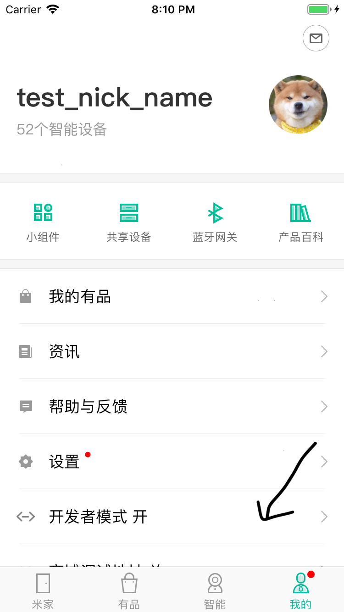
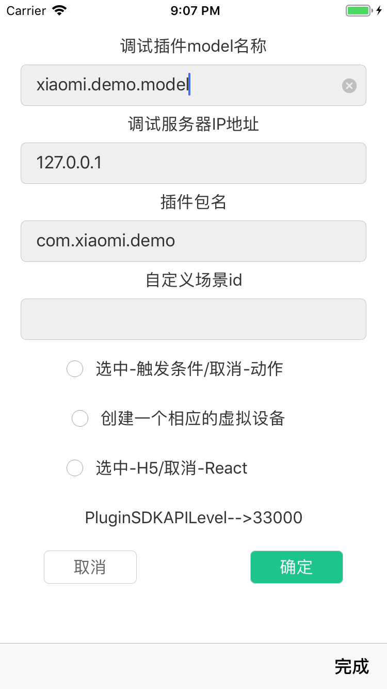
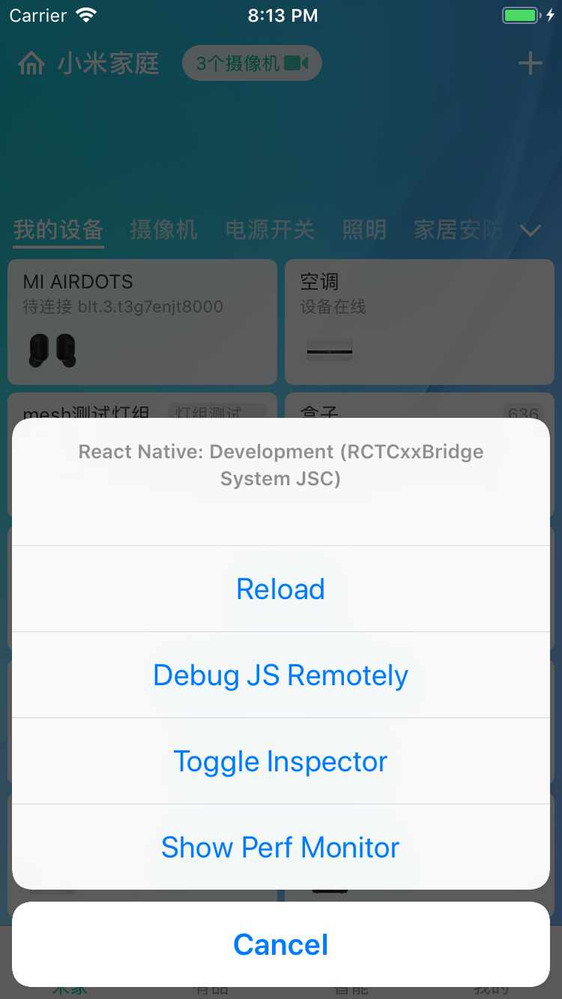
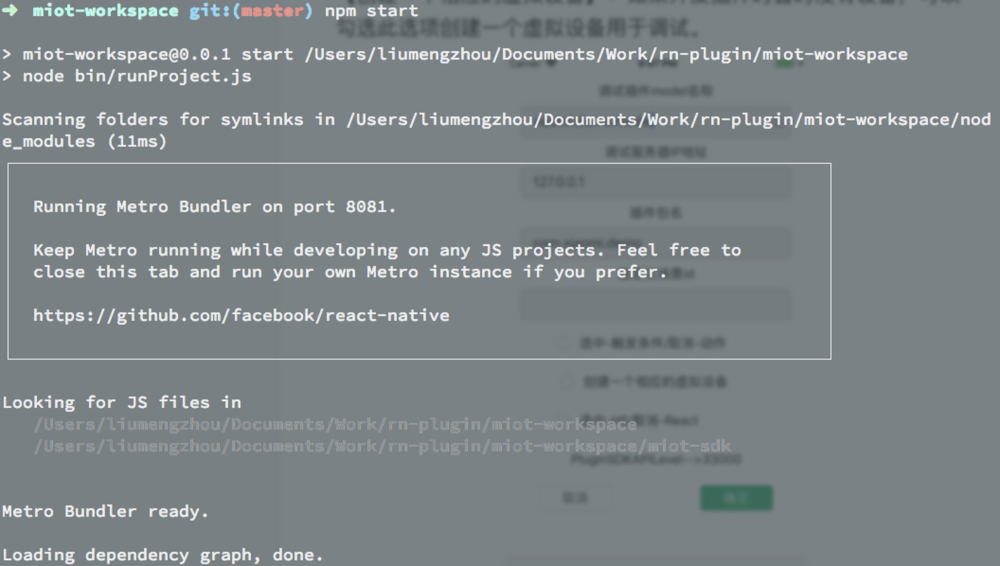

- [ReactNative安装调试](#ReactNative安装调试)
- [Android插件调试](#android插件调试)
- [iOS插件调试](#ios插件调试)

### ReactNative安装调试

可以参考[facebook文档](https://facebook.github.io/react-native/docs/getting-started.html)，也可以按照如下步骤操作：

1. 下载 node 并安装。 [http://nodejs.cn/download/](http://nodejs.cn/download/) 或 [https://nodejs.org/zh-cn/download/](https://nodejs.org/zh-cn/download/)
2. 安装完成之后，在命令行可是使用 npm 命令了。执行 **npm install -g react-native-cli**
3. 如果需要远程调试，请参照[https://facebook.github.io/react-native/docs/debugging](https://facebook.github.io/react-native/docs/debugging).

    流程如下：按菜单键或者摇动手机打开 Developer Menu->选择 Debug JS Remotely-> chrome 自动打开http://localhost:8081/debugger-ui/ -> 按照提示按下 ⌘⌥R -> 打开页面如下图选 左侧的 page 找到项目代码打断点就可以了。
    
    
4. npm start命令支持如下参数

    npm start -- --host \[host\] --port \[port\] --reset-cache

### Android插件调试

1. 下载并安装调试环境的 android 米家 apk，依次点击 首页“我的”tab -> 设置 -> 开发者选项 -> RN设备插件调试设置

2. 开启设备 rn 调试 选中，插件包名 填写 MiEcosystem/miot-plugin-sdk/projects 下项目的相对路径 如：com.xiaomi.demo
设备 model 按照插件包名对应路径的设备填写 如：xiaomi.demo.v1。
   **注意打开米家(com.xiaomi.smarthome 的进程从无到有)就要重新设置1，2步骤。**

3. 插件包下project.json文件配置 package_name必须为项目的相对路径，developer_id 验证插件包的合法性使用，必须和开放平台配置的一致。models设备的 model 多个用“|”分隔，version插件版本号，min_sdk_api_level 允许运行的米家最小 api 版本

4. 绑定设备后点击米家首页对应的设备，进入到 rn 插件页面。

 

5. 在miot-plugin-sdk目录下，第一次运行先执行npm install,完成后生成文件夹node_modules，如果电脑上配置了 adb，连接手机后输入 adb reverse tcp:8081 tcp:8081 或者用力摇动手机出现的弹框 -> Dev Settings -> Debug server host & port for device,设置npm start的 ip 和端口。如：192.168.1.2:8081,最后运行 npm start ，点击手机上的 Reload。

  

设置完成之后点击 RN 插件页面的左上角 dev 按钮，会 load 插件代码。

6. 查看输出的日志: adb logcat |grep ReactNativeJS 

### iOS插件调试

1.  用**开发者账号**登录app之后，点击「我的」—「开发者模式」进入开发者模式。

2. 填入正确的model，ip（真机需要和电脑处于同一局域网，模拟器填写`localhost`即可）和插件包名。调试自定义场景时，需要填入正确的场景id。 

   【选中-触发条件/取消-动作】：调试**触发条件**时需要勾选，调试**动作**时不用勾选。

   【创建一个相应的虚拟设备】：如果开发插件时暂时没有设备，可以勾选此选项创建一个虚拟设备用于调试。

   

3. *开启远程调试（可选）*

   如果你需要开启远程调试模式（在Chrome 上运行代码），晃动真机 或者在模拟器上选择「Hardware」—「Shake Gesture」，会出现如下弹窗，点击「Debug JS Remotely」即可，其余选项作用请查阅[官方文档](https://facebook.github.io/react-native/docs/debugging)。

4. 在`miot-plugin-sdk`目录下执行`npm start` 命令启动node服务器，如图表示服务启动成功。

   

整个过程中如果遇到什么问题，移步[issue](https://github.com/MiEcosystem/miot-plugin-sdk/issues)。

